# Architecture Diagrams - Strategic Decision System

## 1. System Architecture Overview

### High-Level Data Flow

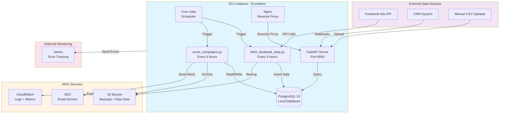

---

## 2. Deployment Timeline

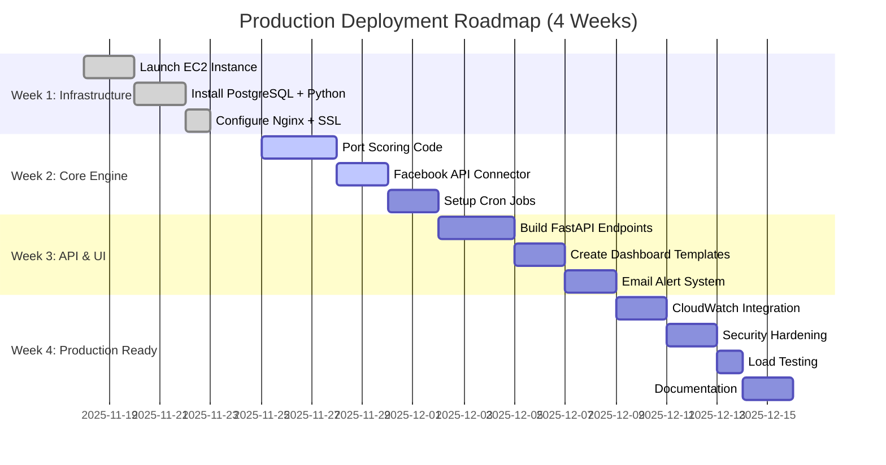

---

## 3. Data Pipeline Flow

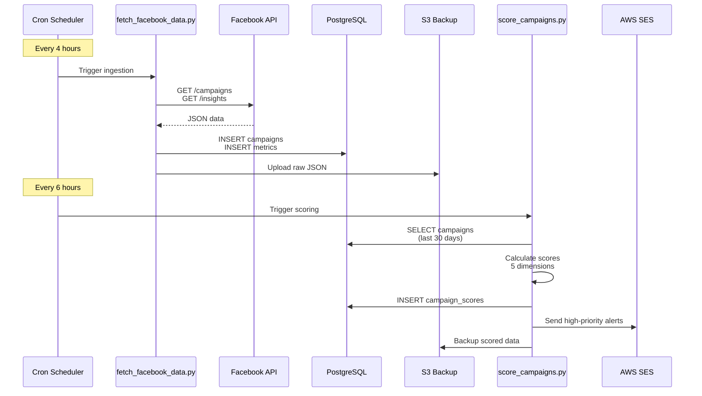

---

## 4. Facebook API Error Handling

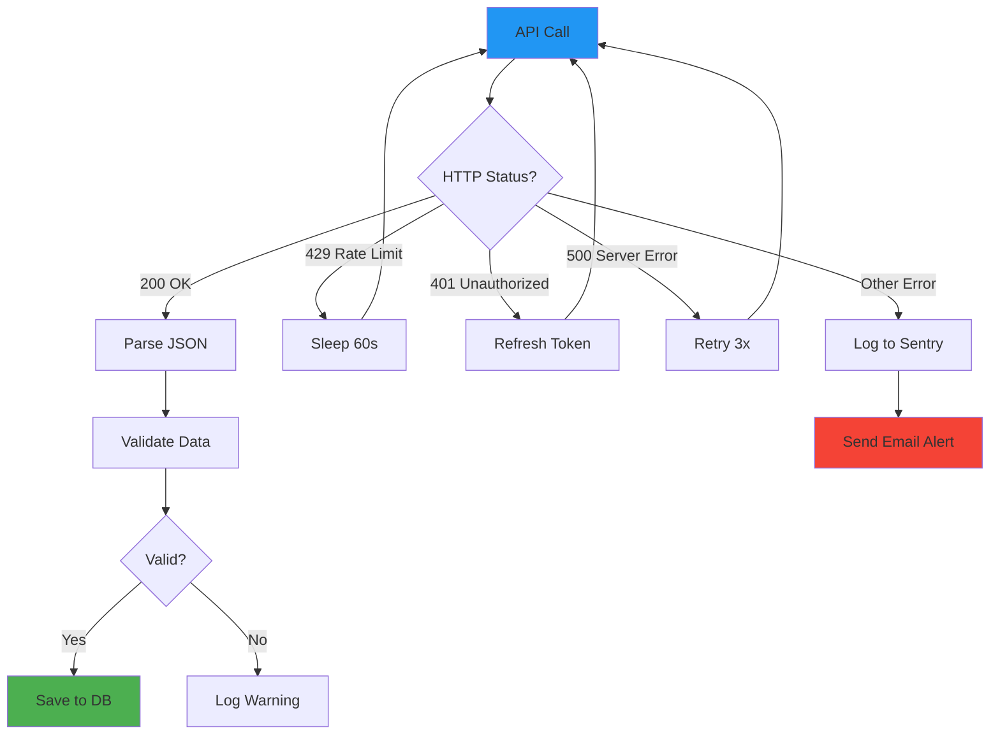

---

## 5. Scoring Engine Logic

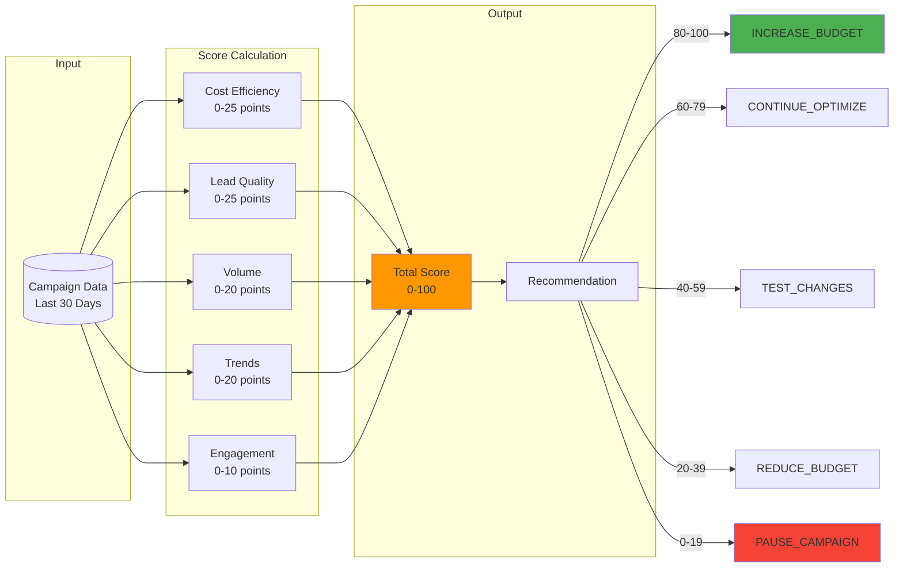

---

## 6. Monitoring Architecture

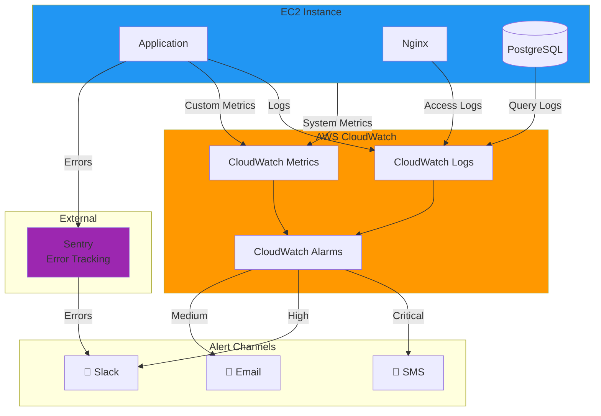

---

## 7. Alert Severity Levels

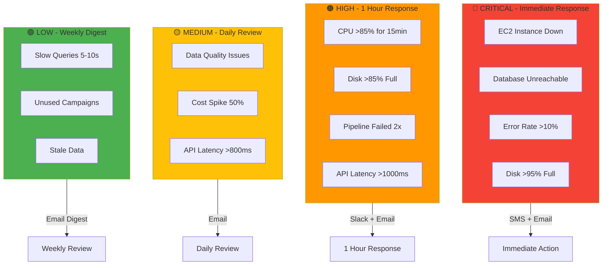

---

## 8. Security Architecture

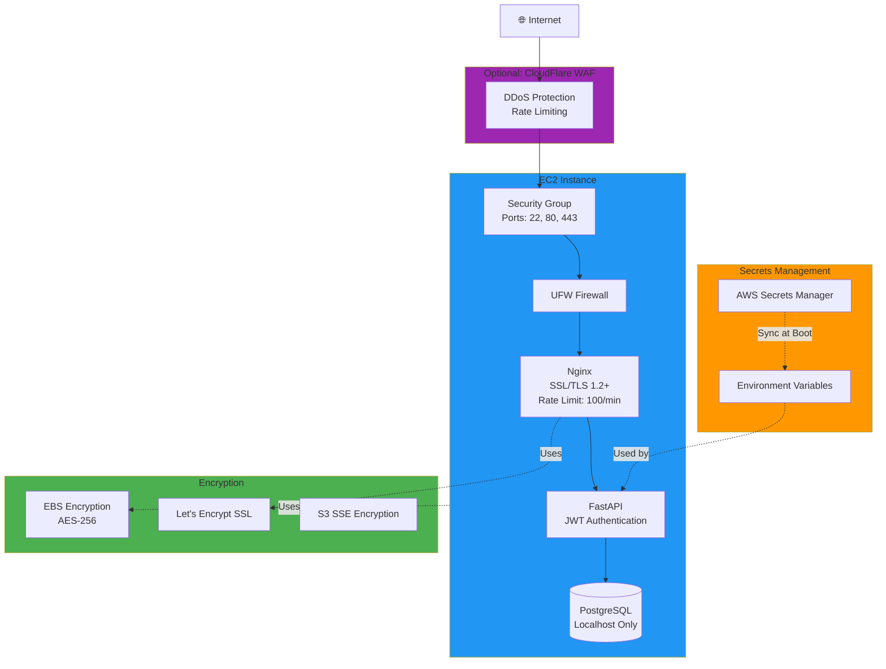

---

## 9. FastAPI Architecture

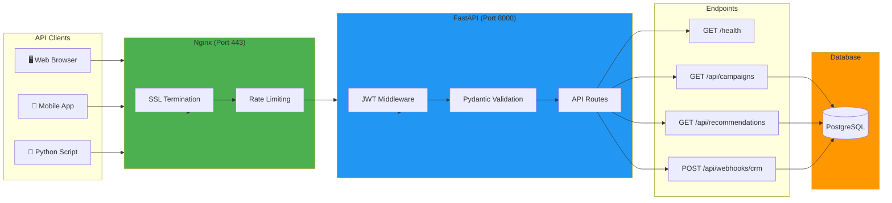

---

## 10. Cost Breakdown (MVP)

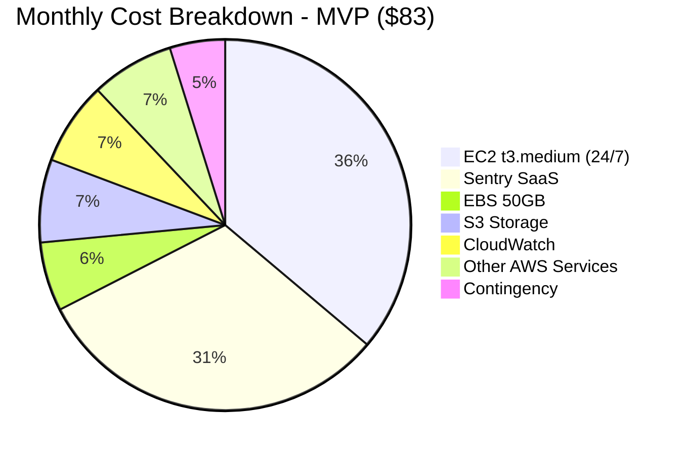

### Cost Scaling Path

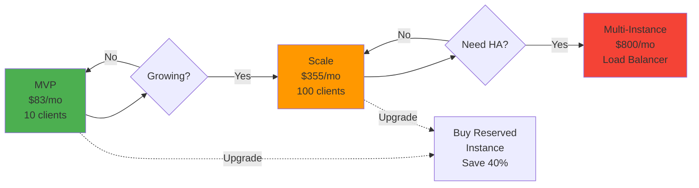

---

## 11. Disaster Recovery Flow

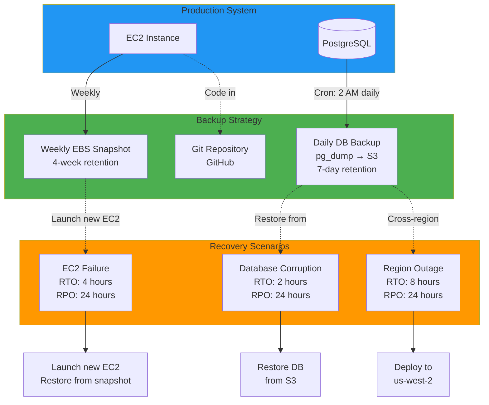

---

## 12. Data Quality Pipeline

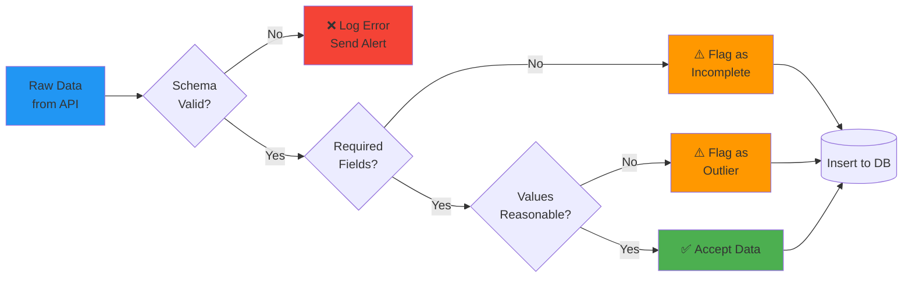

---

## 13. Operational Runbook - Issue Resolution

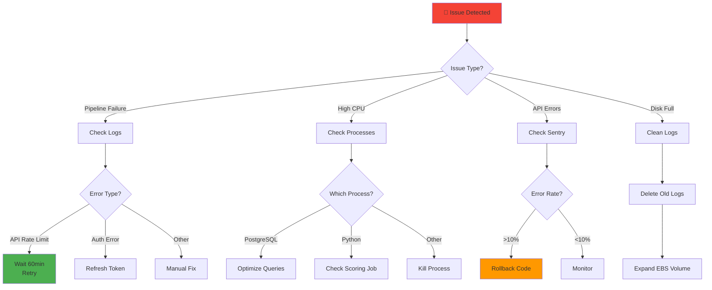

---

## Summary

These diagrams provide a comprehensive visual representation of:
1. **System Architecture** - Single EC2 with all components
2. **Data Pipeline** - Facebook API → PostgreSQL → Scoring → Outputs
3. **Monitoring** - CloudWatch + Sentry + Alerting
4. **Security** - Multiple layers of protection
5. **FastAPI** - Modern API architecture
6. **Cost Optimization** - Scaling path from MVP to production
7. **Disaster Recovery** - Backup and restore procedures
8. **Operations** - Issue resolution workflows

All diagrams use **Mermaid** syntax for easy rendering in GitHub, GitLab, Notion, and other Markdown-compatible platforms.

### High-Level Data Flow

```
                    ┌─────────────────────────────────────┐
                    │      EXTERNAL DATA SOURCES          │
                    │                                     │
                    │  ┌──────────┐    ┌──────────┐     │
                    │  │ Facebook │    │   CRM    │     │
                    │  │ Ads API  │    │  System  │     │
                    │  └─────┬────┘    └────┬─────┘     │
                    └────────┼──────────────┼───────────┘
                             │              │
                             │              │
                   ┌─────────▼──────────────▼──────────┐
                   │    DATA INGESTION LAYER           │
                   │  (AWS Lambda Functions)           │
                   │                                    │
                   │  ┌────────────────────────────┐   │
                   │  │ Facebook Connector         │   │
                   │  │ - Runs every 4 hours       │   │
                   │  │ - Rate limit management    │   │
                   │  │ - OAuth token refresh      │   │
                   │  └────────────────────────────┘   │
                   │                                    │
                   │  ┌────────────────────────────┐   │
                   │  │ CRM Webhook Listener       │   │
                   │  │ - Real-time updates        │   │
                   │  │ - Lead status changes      │   │
                   │  └────────────────────────────┘   │
                   └────────────┬───────────────────────┘
                                │
                                │ Write raw data
                                ▼
                   ┌────────────────────────────────────┐
                   │       DATA STORAGE LAYER           │
                   │                                    │
                   │  ┌──────────────┐  ┌───────────┐  │
                   │  │ PostgreSQL   │  │    S3     │  │
                   │  │   (RDS)      │  │  Bucket   │  │
                   │  │              │  │           │  │
                   │  │ • campaigns  │  │ • Raw CSVs│  │
                   │  │ • metrics    │  │ • Backups │  │
                   │  │ • scores     │  │ • Archives│  │
                   │  └──────┬───────┘  └───────────┘  │
                   └─────────┼──────────────────────────┘
                             │
                             │ Read campaign data
                             ▼
                   ┌────────────────────────────────────┐
                   │    SCORING ENGINE (CORE LOGIC)     │
                   │       AWS Lambda Function          │
                   │                                    │
                   │  ┌────────────────────────────┐   │
                   │  │ 1. Load campaign data      │   │
                   │  │ 2. Calculate 5 dimensions: │   │
                   │  │    • Cost Efficiency       │   │
                   │  │    • Lead Quality          │   │
                   │  │    • Volume                │   │
                   │  │    • Trends                │   │
                   │  │    • Engagement            │   │
                   │  │ 3. Generate recommendation │   │
                   │  │ 4. Store results           │   │
                   │  └────────────────────────────┘   │
                   │                                    │
                   │  Triggered: Every 6 hours (cron)   │
                   └────────────┬───────────────────────┘
                                │
                                │ Publish results
                                ▼
                   ┌────────────────────────────────────┐
                   │      DELIVERY & PRESENTATION       │
                   │                                    │
                   │  ┌──────────┐  ┌──────────────┐   │
                   │  │  Email   │  │  Dashboard   │   │
                   │  │  Alerts  │  │  (Streamlit) │   │
                   │  │  (SES)   │  │  on ECS      │   │
                   │  └──────────┘  └──────────────┘   │
                   │                                    │
                   │  ┌──────────────────────────┐     │
                   │  │    REST API              │     │
                   │  │    (API Gateway +        │     │
                   │  │    Lambda/FastAPI)       │     │
                   │  │                          │     │
                   │  │  GET /scores             │     │
                   │  │  GET /recommendations    │     │
                   │  └──────────────────────────┘     │
                   └────────────────────────────────────┘
```

---

## 2. AWS Service Mapping

### Core Components

```
┌─────────────────────────────────────────────────────────────┐
│                         AWS CLOUD                            │
│                                                              │
│  ┌───────────────────────────────────────────────────────┐  │
│  │                     VPC (Virtual Private Cloud)        │  │
│  │                                                        │  │
│  │  ┌──────────────────┐      ┌──────────────────┐      │  │
│  │  │  Private Subnet  │      │  Public Subnet   │      │  │
│  │  │                  │      │                  │      │  │
│  │  │  ┌────────────┐  │      │  ┌────────────┐ │      │  │
│  │  │  │    RDS     │  │      │  │    ALB     │ │      │  │
│  │  │  │ PostgreSQL │  │      │  │ (Dashboard)│ │      │  │
│  │  │  └────────────┘  │      │  └────────────┘ │      │  │
│  │  │                  │      │                  │      │  │
│  │  │  ┌────────────┐  │      │  ┌────────────┐ │      │  │
│  │  │  │   Lambda   │  │      │  │  NAT GW    │ │      │  │
│  │  │  │  (in VPC)  │  │      │  └────────────┘ │      │  │
│  │  │  └────────────┘  │      │                  │      │  │
│  │  └──────────────────┘      └──────────────────┘      │  │
│  │                                                        │  │
│  └───────────────────────────────────────────────────────┘  │
│                                                              │
│  ┌──────────────────┐      ┌──────────────────┐            │
│  │   Lambda         │      │   S3 Bucket      │            │
│  │   (outside VPC)  │      │   - Raw data     │            │
│  │   - API Gateway  │      │   - Backups      │            │
│  │   - Facebook API │      │   - Archives     │            │
│  └──────────────────┘      └──────────────────┘            │
│                                                              │
│  ┌──────────────────┐      ┌──────────────────┐            │
│  │  EventBridge     │      │   SES (Email)    │            │
│  │  (Scheduler)     │      │   - Alerts       │            │
│  │  - Cron triggers │      │   - Reports      │            │
│  └──────────────────┘      └──────────────────┘            │
│                                                              │
│  ┌──────────────────┐      ┌──────────────────┐            │
│  │  Secrets Manager │      │   CloudWatch     │            │
│  │  - API keys      │      │   - Logs         │            │
│  │  - DB credentials│      │   - Metrics      │            │
│  └──────────────────┘      └──────────────────┘            │
│                                                              │
└─────────────────────────────────────────────────────────────┘
```

---

## 3. Data Pipeline Flow (Detailed)

### Facebook API Ingestion Pipeline

```
┌──────────────────────────────────────────────────────────────┐
│ STEP 1: EventBridge Trigger (Cron: 0 */4 * * *)             │
└──────────────┬───────────────────────────────────────────────┘
               │
               ▼
┌──────────────────────────────────────────────────────────────┐
│ STEP 2: Lambda - Facebook Connector                          │
│                                                               │
│  def handler(event, context):                                │
│      # 1. Get OAuth token from Secrets Manager               │
│      token = get_secret('facebook-api-token')                │
│                                                               │
│      # 2. Fetch campaign data (last 7 days)                  │
│      campaigns = facebook_api.get_campaigns(                 │
│          since='2025-11-08',                                 │
│          fields=['id', 'name', 'budget', 'status']           │
│      )                                                        │
│                                                               │
│      # 3. Fetch metrics (insights)                           │
│      for campaign in campaigns:                              │
│          insights = facebook_api.get_insights(               │
│              campaign_id=campaign['id'],                     │
│              fields=['impressions', 'clicks', 'spend']       │
│          )                                                    │
│          campaign['metrics'] = insights                      │
│                                                               │
│      # 4. Save raw data to S3 (audit trail)                  │
│      s3.put_object(                                          │
│          Bucket='leadsmart-raw-data',                        │
│          Key=f'facebook/{date}/campaigns.json',              │
│          Body=json.dumps(campaigns)                          │
│      )                                                        │
│                                                               │
│      # 5. Insert into RDS (staging table)                    │
│      db.insert('staging_campaigns', campaigns)               │
│                                                               │
│      # 6. Data quality checks                                │
│      validation_errors = validate_data(campaigns)            │
│      if validation_errors:                                   │
│          send_alert('Data quality issues', validation_errors)│
│                                                               │
│      # 7. Promote to production table                        │
│      db.execute('''                                          │
│          INSERT INTO campaigns                               │
│          SELECT * FROM staging_campaigns                     │
│          ON CONFLICT (campaign_id) DO UPDATE ...             │
│      ''')                                                     │
│                                                               │
│      return {'statusCode': 200, 'campaigns_processed': len} │
└──────────────┬───────────────────────────────────────────────┘
               │
               │ On success: Publish to SNS topic
               │ On failure: Send to DLQ, retry 3x
               ▼
┌──────────────────────────────────────────────────────────────┐
│ STEP 3: CloudWatch Logs & Metrics                            │
│                                                               │
│  • Log: "Processed 1,234 campaigns in 45 seconds"           │
│  • Metric: facebook_api_calls = 67                           │
│  • Metric: campaigns_updated = 1,234                         │
└───────────────────────────────────────────────────────────────┘
```

---

## 4. Scoring Engine Flow (Detailed)

```
┌──────────────────────────────────────────────────────────────┐
│ INPUT: Trigger (EventBridge cron or manual invoke)           │
└──────────────┬───────────────────────────────────────────────┘
               │
               ▼
┌──────────────────────────────────────────────────────────────┐
│ STEP 1: Load Data from RDS                                   │
│                                                               │
│  SELECT                                                       │
│      c.campaign_id,                                          │
│      c.campaign_name,                                        │
│      c.daily_budget,                                         │
│      m.impressions,                                          │
│      m.clicks,                                               │
│      m.spend,                                                │
│      m.ctr,                                                  │
│      COUNT(l.lead_id) as total_leads,                        │
│      SUM(CASE WHEN l.status = 'qualified' THEN 1 ELSE 0 END) │
│          as qualified_leads                                  │
│  FROM campaigns c                                            │
│  LEFT JOIN campaign_metrics m ON c.campaign_id = m.campaign_id│
│  LEFT JOIN campaign_leads l ON c.campaign_id = l.campaign_id│
│  WHERE m.date >= NOW() - INTERVAL '30 days'                 │
│  GROUP BY c.campaign_id                                      │
│                                                               │
│  Result: DataFrame with 5,000 campaigns                      │
└──────────────┬───────────────────────────────────────────────┘
               │
               ▼
┌──────────────────────────────────────────────────────────────┐
│ STEP 2: Calculate Scores (5 Dimensions)                      │
│                                                               │
│  for campaign in campaigns:                                  │
│      # Dimension 1: Cost Efficiency (0-25 points)            │
│      cpql = campaign['spend'] / campaign['qualified_leads']  │
│      cost_score = calculate_cost_score(cpql)                 │
│                                                               │
│      # Dimension 2: Lead Quality (0-25 points)               │
│      qual_rate = campaign['qualified_leads'] / total_leads   │
│      quality_score = calculate_quality_score(qual_rate)      │
│                                                               │
│      # Dimension 3: Volume (0-20 points)                     │
│      volume_score = calculate_volume_score(qualified_leads)  │
│                                                               │
│      # Dimension 4: Trends (0-20 points)                     │
│      trend_score = calculate_trend_score(campaign)           │
│                                                               │
│      # Dimension 5: Engagement (0-10 points)                 │
│      engagement_score = calculate_engagement_score(ctr)      │
│                                                               │
│      # Total Score                                           │
│      total_score = sum([cost, quality, volume, trend, eng])  │
│                                                               │
│      # Recommendation Logic                                  │
│      if total_score >= 80:                                   │
│          recommendation = 'INCREASE_BUDGET'                  │
│      elif total_score >= 60:                                 │
│          recommendation = 'CONTINUE_OPTIMIZE'                │
│      elif total_score >= 40:                                 │
│          recommendation = 'TEST_CHANGES'                     │
│      elif total_score >= 20:                                 │
│          recommendation = 'REDUCE_BUDGET'                    │
│      else:                                                   │
│          recommendation = 'PAUSE_CAMPAIGN'                   │
└──────────────┬───────────────────────────────────────────────┘
               │
               ▼
┌──────────────────────────────────────────────────────────────┐
│ STEP 3: Save Results to Database                             │
│                                                               │
│  INSERT INTO campaign_scores (                               │
│      campaign_id, date, total_score,                         │
│      cost_efficiency_score, lead_quality_score,              │
│      volume_score, trend_score, engagement_score,            │
│      recommendation, recommendation_details                  │
│  ) VALUES (...)                                              │
│  ON CONFLICT (campaign_id, date)                             │
│  DO UPDATE SET ...                                           │
│                                                               │
│  -- Also insert into score_history for trend analysis        │
│  INSERT INTO score_history (                                 │
│      campaign_id, date, total_score, recommendation          │
│  ) VALUES (...)                                              │
└──────────────┬───────────────────────────────────────────────┘
               │
               ▼
┌──────────────────────────────────────────────────────────────┐
│ STEP 4: Trigger Downstream Actions                           │
│                                                               │
│  • Publish to SNS topic: 'campaign-scores-updated'           │
│  • Email Lambda subscribes to SNS, sends alerts              │
│  • Dashboard reads from RDS (no action needed)               │
│  • CloudWatch logs: "Scored 5,000 campaigns in 3.2 minutes" │
└──────────────┬───────────────────────────────────────────────┘
               │
               ▼
┌──────────────────────────────────────────────────────────────┐
│ OUTPUT: Campaign scores stored, alerts triggered             │
└───────────────────────────────────────────────────────────────┘
```

---

## 5. Security Architecture

```
┌─────────────────────────────────────────────────────────────┐
│                  INTERNET (Public Access)                    │
└──────────────┬──────────────────────────────────────────────┘
               │
               │ HTTPS (TLS 1.2+)
               ▼
┌─────────────────────────────────────────────────────────────┐
│ AWS WAF (Web Application Firewall) - Optional Phase 2       │
│  • Rate limiting (100 req/min per IP)                        │
│  • SQL injection protection                                  │
│  • XSS protection                                            │
└──────────────┬──────────────────────────────────────────────┘
               │
               ▼
┌─────────────────────────────────────────────────────────────┐
│ CloudFront (CDN) - Optional for dashboard static assets     │
│  • SSL certificate (ACM)                                     │
│  • DDOS protection (AWS Shield)                              │
└──────────────┬──────────────────────────────────────────────┘
               │
               ▼
┌─────────────────────────────────────────────────────────────┐
│ Application Load Balancer (ALB)                              │
│  • HTTPS listener (port 443)                                 │
│  • SSL certificate (ACM)                                     │
│  • Health checks (every 30 sec)                              │
└──────────────┬──────────────────────────────────────────────┘
               │
               ▼
┌─────────────────────────────────────────────────────────────┐
│ AWS Cognito (Authentication)                                 │
│  • User pool (email + password)                              │
│  • JWT tokens (1 hour expiry)                                │
│  • MFA (optional, SMS or TOTP)                               │
└──────────────┬──────────────────────────────────────────────┘
               │
               │ Authorized requests only
               ▼
┌─────────────────────────────────────────────────────────────┐
│ Application Layer (ECS Fargate + Lambda)                     │
│  • IAM roles (principle of least privilege)                  │
│  • Security groups (restrict inbound to ALB only)            │
│  • Environment variables (encrypted at rest)                 │
└──────────────┬──────────────────────────────────────────────┘
               │
               │ TLS connection
               ▼
┌─────────────────────────────────────────────────────────────┐
│ RDS PostgreSQL (Private Subnet)                              │
│  • Encryption at rest (AES-256)                              │
│  • SSL connections enforced                                  │
│  • Security group (port 5432 from app only)                  │
│  • No public IP address                                      │
│  • Master user password in Secrets Manager                   │
└──────────────┬──────────────────────────────────────────────┘
               │
               ▼
┌─────────────────────────────────────────────────────────────┐
│ Audit & Monitoring                                           │
│  • CloudTrail (all API calls logged)                         │
│  • CloudWatch Logs (application logs)                        │
│  • VPC Flow Logs (network traffic)                           │
│  • AWS Config (compliance checks)                            │
└──────────────────────────────────────────────────────────────┘
```

### IAM Roles & Policies

```
┌─────────────────────────────────────────────────────────────┐
│ Lambda Execution Role: "scoring-engine-lambda-role"          │
│                                                               │
│  Permissions:                                                 │
│  • logs:CreateLogGroup, logs:CreateLogStream, logs:PutLogEvents│
│  • rds:DescribeDBInstances (read-only)                       │
│  • secretsmanager:GetSecretValue (specific secrets only)     │
│  • s3:PutObject (leadsmart-raw-data bucket only)             │
│  • sns:Publish (campaign-scores-updated topic only)          │
│  • ec2:CreateNetworkInterface (for VPC access)               │
│                                                               │
│  Trust Policy:                                                │
│  {                                                            │
│    "Principal": {"Service": "lambda.amazonaws.com"},         │
│    "Action": "sts:AssumeRole"                                │
│  }                                                            │
└───────────────────────────────────────────────────────────────┘

┌─────────────────────────────────────────────────────────────┐
│ ECS Task Role: "dashboard-ecs-task-role"                     │
│                                                               │
│  Permissions:                                                 │
│  • logs:CreateLogGroup, logs:CreateLogStream, logs:PutLogEvents│
│  • rds:DescribeDBInstances (read-only)                       │
│  • secretsmanager:GetSecretValue (DB credentials only)       │
│  • s3:GetObject (dashboard-assets bucket only)               │
│                                                               │
│  Trust Policy:                                                │
│  {                                                            │
│    "Principal": {"Service": "ecs-tasks.amazonaws.com"},      │
│    "Action": "sts:AssumeRole"                                │
│  }                                                            │
└───────────────────────────────────────────────────────────────┘
```

---

## 6. Monitoring Architecture

```
┌─────────────────────────────────────────────────────────────┐
│                    APPLICATION LAYER                         │
│                                                               │
│  ┌───────────┐    ┌───────────┐    ┌───────────┐           │
│  │  Lambda   │    │    ECS    │    │    API    │           │
│  │ Functions │    │  Fargate  │    │  Gateway  │           │
│  └─────┬─────┘    └─────┬─────┘    └─────┬─────┘           │
│        │                 │                 │                 │
│        │ Emit logs       │ Emit logs       │ Emit logs       │
│        │ & metrics       │ & metrics       │ & metrics       │
│        └─────────────────┴─────────────────┘                 │
└──────────────────────────┬──────────────────────────────────┘
                           │
                           ▼
┌─────────────────────────────────────────────────────────────┐
│                    CloudWatch Logs                           │
│  • Log Group: /aws/lambda/scoring-engine                     │
│  • Log Group: /ecs/dashboard                                 │
│  • Log Group: /aws/apigateway/leadsmart                      │
│                                                               │
│  Retention: 30 days                                          │
│  Insights queries: Cost analysis, error rate, slow queries   │
└──────────────┬──────────────────────────────────────────────┘
               │
               ▼
┌─────────────────────────────────────────────────────────────┐
│                 CloudWatch Metrics                           │
│                                                               │
│  Custom Metrics:                                              │
│  • CampaignsScored (count)                                   │
│  • ScoringDuration (milliseconds)                            │
│  • FacebookAPICalls (count)                                  │
│  • DataQualityErrors (count)                                 │
│                                                               │
│  AWS Metrics:                                                 │
│  • Lambda: Invocations, Errors, Duration, Throttles          │
│  • RDS: CPUUtilization, DatabaseConnections, ReadLatency     │
│  • ECS: CPUUtilization, MemoryUtilization                    │
│  • API Gateway: Count, Latency, 4XXError, 5XXError          │
└──────────────┬──────────────────────────────────────────────┘
               │
               ▼
┌─────────────────────────────────────────────────────────────┐
│               CloudWatch Alarms                              │
│                                                               │
│  Critical:                                                    │
│  • Lambda error rate >5% for 5 minutes → PagerDuty           │
│  • RDS CPU >90% for 10 minutes → PagerDuty                   │
│  • Data pipeline failed 3x → PagerDuty                       │
│                                                               │
│  High:                                                        │
│  • API latency p95 >1000ms for 5 minutes → Slack            │
│  • Email bounce rate >10% → Slack                            │
│                                                               │
│  Medium:                                                      │
│  • Daily AWS spend >$50 → Email                              │
│  • Data quality errors >20% → Email                          │
└──────────────┬──────────────────────────────────────────────┘
               │
               ▼
┌─────────────────────────────────────────────────────────────┐
│            Sentry (Error Tracking)                           │
│                                                               │
│  • Real-time error alerts                                    │
│  • Full stack traces                                         │
│  • Error grouping & deduplication                            │
│  • Release tracking (which deployment caused errors?)        │
│                                                               │
│  Integration: Python SDK in Lambda & ECS                     │
└──────────────┬──────────────────────────────────────────────┘
               │
               ▼
┌─────────────────────────────────────────────────────────────┐
│              Alerting Destinations                           │
│                                                               │
│  • PagerDuty (critical alerts, wake up on-call)              │
│  • Slack #leadsmart-alerts (high/medium alerts)              │
│  • Email (daily digest, weekly reports)                      │
└──────────────────────────────────────────────────────────────┘
```

---

## 7. Disaster Recovery Architecture

```
┌─────────────────────────────────────────────────────────────┐
│                    PRIMARY REGION (us-east-1)                │
│                                                               │
│  ┌──────────────┐    ┌──────────────┐    ┌──────────────┐  │
│  │   Lambda     │    │   RDS        │    │     S3       │  │
│  │  Functions   │    │  PostgreSQL  │    │   Bucket     │  │
│  │              │    │              │    │              │  │
│  │ • Scoring    │    │ • campaigns  │    │ • Raw data   │  │
│  │ • Ingestion  │    │ • metrics    │    │ • Backups    │  │
│  │ • API        │    │ • scores     │    │              │  │
│  └──────────────┘    └──────┬───────┘    └──────┬───────┘  │
│                              │                    │          │
└──────────────────────────────┼────────────────────┼──────────┘
                               │                    │
                               │ Auto backup        │ Replication
                               │ every 6 hours      │
                               ▼                    ▼
┌─────────────────────────────────────────────────────────────┐
│                BACKUP & ARCHIVE STORAGE                      │
│                                                               │
│  ┌──────────────────────────────────────────────┐           │
│  │ RDS Automated Backups (us-east-1)            │           │
│  │ • Daily snapshots (7-day retention)          │           │
│  │ • Point-in-time recovery (5-minute RPO)      │           │
│  │ • Can restore to any time in last 7 days    │           │
│  └──────────────────────────────────────────────┘           │
│                                                               │
│  ┌──────────────────────────────────────────────┐           │
│  │ S3 Cross-Region Replication (us-east-1 → us-west-2)│     │
│  │ • Replicates all raw data & backups          │           │
│  │ • Versioning enabled (30-day retention)      │           │
│  │ • Can restore from us-west-2 if us-east-1 down│         │
│  └──────────────────────────────────────────────┘           │
│                                                               │
│  ┌──────────────────────────────────────────────┐           │
│  │ S3 Glacier (Long-term archive)               │           │
│  │ • Data older than 90 days moved to Glacier   │           │
│  │ • 1-year retention                            │           │
│  │ • Retrieval time: 1-5 hours                  │           │
│  └──────────────────────────────────────────────┘           │
└──────────────────────────────────────────────────────────────┘
```

### Recovery Procedures

```
Scenario 1: Database Corruption
├── Detection: Data quality check fails, invalid data in production table
├── Impact: Users see incorrect scores
├── RTO: 4 hours
├── RPO: 24 hours
└── Procedure:
    1. Identify corruption timestamp (check CloudWatch logs)
    2. Find last good snapshot (before corruption)
    3. Restore RDS from snapshot:
       aws rds restore-db-instance-from-db-snapshot \
         --db-instance-identifier leadsmart-restored \
         --db-snapshot-identifier rds:leadsmart-2025-11-14-06-00
    4. Update DNS to point to restored instance (or update app config)
    5. Re-run scoring for missing period (between snapshot and now)
    6. Verify data integrity with validation queries
    7. Cut over to restored instance

Scenario 2: Lambda Function Bug (Producing Incorrect Scores)
├── Detection: Sentry alert, user reports, or validation test failure
├── Impact: Incorrect recommendations sent to users
├── RTO: 5 minutes
├── RPO: 0 (no data loss)
└── Procedure:
    1. Identify bad deployment (check GitHub commit, Sentry release)
    2. Rollback Lambda to previous version:
       aws lambda update-alias --function-name scoring-engine-prod \
         --name production --function-version 42
    3. Verify rollback with smoke test (invoke Lambda manually)
    4. Re-score affected campaigns (query scores from bad deployment period)
    5. Send corrected recommendations to users
    6. Post-mortem: What caused the bug? Add test case to prevent recurrence

Scenario 3: Region Outage (us-east-1 Unavailable)
├── Detection: All services in us-east-1 returning errors
├── Impact: Complete service outage
├── RTO: 8 hours (if DR environment pre-provisioned in us-west-2)
├── RPO: 24 hours
└── Procedure:
    1. Confirm region-wide outage (AWS Service Health Dashboard)
    2. Activate DR plan (page DevOps lead)
    3. Restore RDS from latest snapshot to us-west-2:
       aws rds restore-db-instance-from-db-snapshot \
         --db-instance-identifier leadsmart-prod-usw2 \
         --db-snapshot-identifier rds:leadsmart-latest \
         --region us-west-2
    4. Deploy Lambda functions to us-west-2 (Terraform apply -var region=us-west-2)
    5. Update DNS (Route53) to point to us-west-2 load balancer
    6. Verify all services operational in us-west-2
    7. Communicate to users (service restored, may have stale data from last 24h)
    8. Once us-east-1 recovers, migrate back (reverse procedure)
```

---

## 8. Cost Breakdown Visualization

```
Monthly Cost Breakdown (MVP - $90/month)
┌────────────────────────────────────────────────────────┐
│                                                         │
│  RDS (db.t4g.micro)        ████████████  $13  (14%)    │
│  ECS Fargate (Dashboard)   ███████████████  $15  (17%) │
│  Sentry (SaaS)             ████████████████████  $26  (29%)│
│  Lambda (Scoring)          ████  $4  (4%)               │
│  Lambda (Ingestion)        ███  $3  (3%)                │
│  S3 Storage                ██████  $6  (7%)             │
│  CloudWatch Logs           ███  $3  (3%)                │
│  Secrets Manager           ██  $2  (2%)                 │
│  Other (SES, API GW, etc.) ████  $3  (3%)               │
│  Contingency               ███████████  $15  (17%)      │
│                                                         │
│  TOTAL: $90/month                                       │
└────────────────────────────────────────────────────────┘

Monthly Cost Breakdown (Scale - $461/month at 100 clients)
┌────────────────────────────────────────────────────────┐
│                                                         │
│  Sentry (Team plan)        ████████  $80  (17%)        │
│  Lambda (Scoring)          ████████████  $80  (17%)    │
│  Contingency               ███████████  $75  (16%)     │
│  S3 Storage                ████████  $60  (13%)        │
│  RDS (db.t4g.small)        ████████  $35  (8%)         │
│  Lambda (Ingestion)        ████████  $30  (7%)         │
│  ECS Fargate (Dashboard)   ████████  $30  (7%)         │
│  CloudWatch Logs           ██████  $25  (5%)           │
│  ElastiCache Redis         ████  $12  (3%)             │
│  SES (Email)               ████  $10  (2%)             │
│  Other                     █████  $24  (5%)            │
│                                                         │
│  TOTAL: $461/month                                      │
└────────────────────────────────────────────────────────┘
```

---

## 9. Deployment Pipeline (CI/CD)

```
┌─────────────────────────────────────────────────────────────┐
│                 Developer Workflow                           │
└──────────────┬──────────────────────────────────────────────┘
               │
               ▼
┌─────────────────────────────────────────────────────────────┐
│ 1. Developer commits code to feature branch                  │
│    git checkout -b feature/add-trend-scoring                 │
│    git commit -m "Add trend scoring logic"                   │
│    git push origin feature/add-trend-scoring                 │
└──────────────┬──────────────────────────────────────────────┘
               │
               ▼
┌─────────────────────────────────────────────────────────────┐
│ 2. GitHub Actions: Run Tests (on push to any branch)         │
│                                                               │
│    jobs:                                                      │
│      test:                                                    │
│        runs-on: ubuntu-latest                                │
│        steps:                                                 │
│          - name: Run unit tests                              │
│            run: pytest tests/unit/ --cov=src                 │
│          - name: Run linting                                 │
│            run: flake8 src/ tests/                           │
│          - name: Run type checking                           │
│            run: mypy src/                                    │
│                                                               │
│    Result: ✅ All checks passed OR ❌ Tests failed           │
└──────────────┬──────────────────────────────────────────────┘
               │
               │ If tests pass
               ▼
┌─────────────────────────────────────────────────────────────┐
│ 3. Developer creates Pull Request (PR)                       │
│    Title: "Add trend scoring logic"                          │
│    Reviewers: Data team lead, DevOps engineer                │
└──────────────┬──────────────────────────────────────────────┘
               │
               │ After review approval
               ▼
┌─────────────────────────────────────────────────────────────┐
│ 4. Merge PR to `develop` branch                              │
│    Triggers: GitHub Actions workflow "deploy-staging"        │
└──────────────┬──────────────────────────────────────────────┘
               │
               ▼
┌─────────────────────────────────────────────────────────────┐
│ 5. GitHub Actions: Deploy to Staging                         │
│                                                               │
│    jobs:                                                      │
│      deploy-staging:                                          │
│        runs-on: ubuntu-latest                                │
│        steps:                                                 │
│          - name: Build Docker image                          │
│            run: docker build -t scoring-engine:${{ sha }} .  │
│          - name: Push to ECR                                 │
│            run: docker push ecr.aws/.../scoring-engine:$sha  │
│          - name: Deploy Lambda (Terraform)                   │
│            run: |                                            │
│              cd infrastructure                               │
│              terraform workspace select staging              │
│              terraform apply -var image_tag=$sha -auto-approve│
│          - name: Run smoke tests                             │
│            run: pytest tests/smoke/ --env=staging            │
│                                                               │
│    Result: Staging environment updated with new code         │
└──────────────┬──────────────────────────────────────────────┘
               │
               │ After 48-hour soak test
               ▼
┌─────────────────────────────────────────────────────────────┐
│ 6. Promote to Production                                     │
│    git checkout main                                         │
│    git merge develop --no-ff                                 │
│    git tag -a v1.2.0 -m "Release v1.2.0: Add trend scoring" │
│    git push origin main --tags                               │
└──────────────┬──────────────────────────────────────────────┘
               │
               ▼
┌─────────────────────────────────────────────────────────────┐
│ 7. GitHub Actions: Deploy to Production (tag trigger)        │
│                                                               │
│    jobs:                                                      │
│      deploy-production:                                       │
│        runs-on: ubuntu-latest                                │
│        environment: production  # Requires manual approval   │
│        steps:                                                 │
│          - name: Wait for approval (manual gate)             │
│            uses: trstringer/manual-approval@v1               │
│          - name: Deploy to production (blue-green)           │
│            run: |                                            │
│              # Deploy to 'green' environment                 │
│              terraform apply -var env=production-green       │
│              # Run smoke tests on green                      │
│              pytest tests/smoke/ --env=production-green      │
│              # If tests pass, switch traffic to green        │
│              aws lambda update-alias --function-name scoring \│
│                --name production --routing-config \         │
│                AdditionalVersionWeights={green=0.1}          │
│              # Monitor for 30 minutes                        │
│              sleep 1800                                      │
│              # If no errors, route 100% to green            │
│              aws lambda update-alias ... \                   │
│                --routing-config AdditionalVersionWeights={}  │
│                                                               │
│    Result: Production updated, with automatic rollback on error│
└──────────────┬──────────────────────────────────────────────┘
               │
               ▼
┌─────────────────────────────────────────────────────────────┐
│ 8. Post-Deployment Verification                              │
│    • CloudWatch dashboard: Check for error spikes            │
│    • Sentry: Monitor new error reports                       │
│    • User feedback: Any complaints in Slack?                 │
│    • Validation test: Run scoring on known dataset, verify   │
└──────────────────────────────────────────────────────────────┘
```

---

## Summary

This architecture document provides visual representations of:
1. **High-level system architecture** - How components interact
2. **AWS service mapping** - Which AWS services are used where
3. **Data pipeline flow** - Step-by-step data ingestion & scoring
4. **Security architecture** - Layers of defense (WAF, IAM, encryption)
5. **Monitoring architecture** - Logs, metrics, alerts flow
6. **Disaster recovery** - Backup strategies & recovery procedures
7. **Cost breakdown** - Where money is spent (MVP vs Scale)
8. **CI/CD pipeline** - Code to production deployment flow

**Recommended Diagramming Tools:**
- **draw.io** (free, web-based) - For flowcharts and architecture diagrams
- **Lucidchart** (free tier available) - Collaborative diagramming
- **Excalidraw** (free, open-source) - Hand-drawn style diagrams
- **CloudCraft** (AWS-specific) - 3D AWS architecture diagrams
- **Mermaid** (markdown-based) - Version-controlled diagrams in code

For the actual assessment, I recommend creating visual diagrams using one of these tools and exporting as PNG/PDF to accompany the written production plan.
