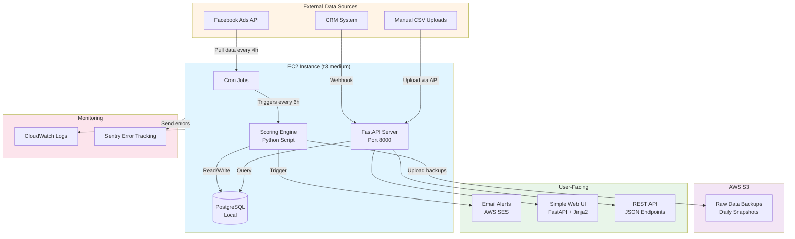
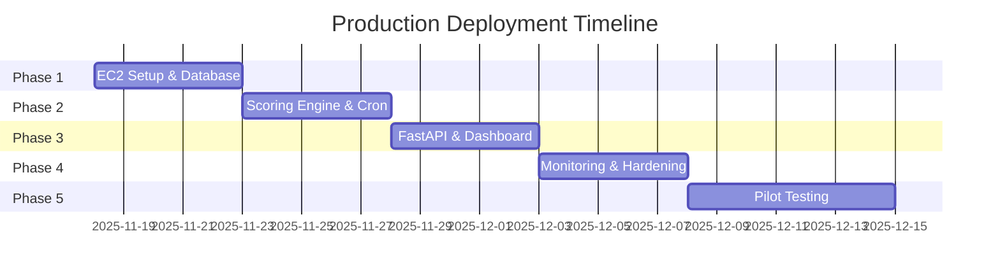
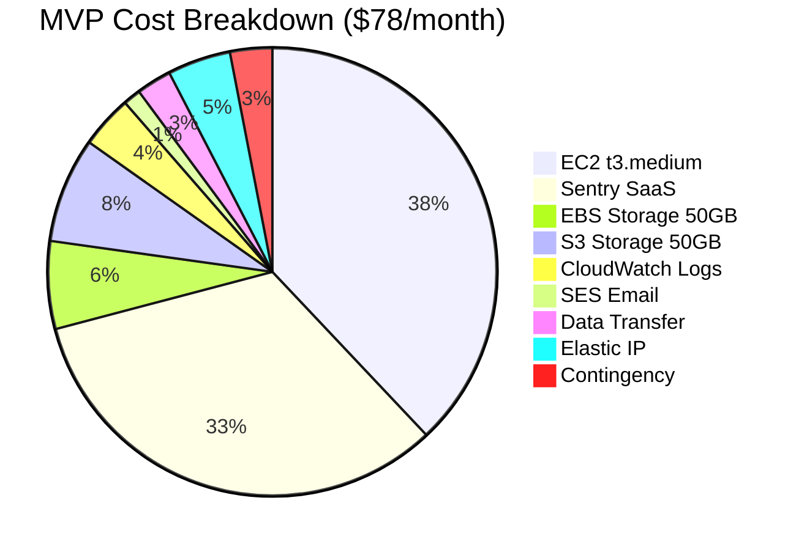
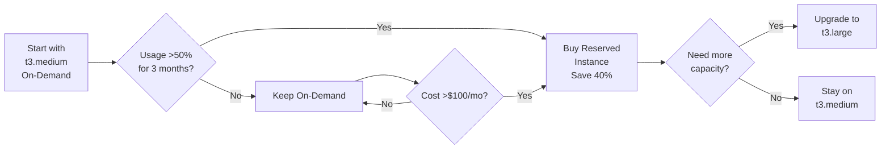
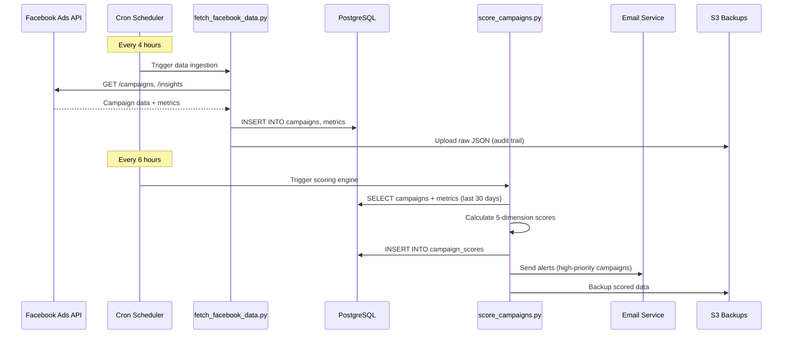
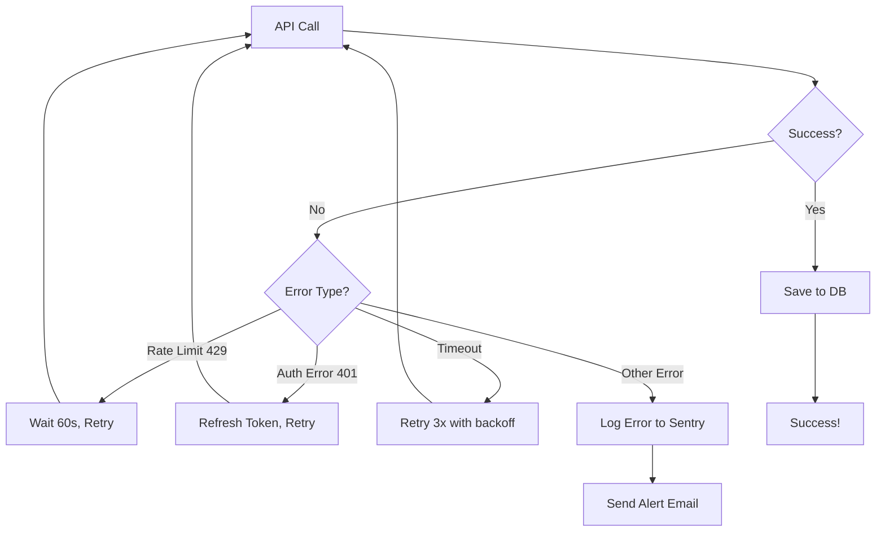

# Part 6: Production Deployment Plan
## Strategic Decision System - Production Implementation

**System:** Campaign Scoring & Recommendation Engine (Part 4)  
**Author:** Senior Data Scientist Candidate  
**Date:** November 2025  
**Version:** 2.0

---

## Executive Summary

This document outlines the production deployment strategy for the Strategic Decision System—a campaign scoring engine that evaluates marketing campaigns across five dimensions and generates actionable recommendations (pause, reduce, continue, optimize, or scale budget).

**Key Decisions:**
- **Architecture:** Minimal infrastructure - Single EC2 instance with PostgreSQL, FastAPI, and scheduled jobs
- **Estimated Monthly Cost:** $50-80 for MVP, scaling to $200-300 at 100 clients
- **Timeline:** 3-4 weeks from kickoff to production
- **Primary Risk:** Single point of failure (EC2), Facebook API rate limits

---

## 1. System Architecture

### 1.1 High-Level Architecture



### 1.2 Technology Stack

#### Core Infrastructure
| Component | Technology | Rationale |
|-----------|-----------|-----------|
| **Compute** | AWS EC2 t3.medium (2 vCPU, 4GB RAM) | Simple, single instance; no orchestration overhead |
| **OS** | Ubuntu 22.04 LTS | Long-term support, widely documented |
| **Database** | PostgreSQL 15 (installed on EC2) | Relational data with complex queries; co-located for low latency |
| **Storage** | AWS S3 Standard-IA | Long-term storage of raw data + backups |
| **Web Server** | FastAPI + Uvicorn | Modern Python async framework; auto-generated docs |
| **Reverse Proxy** | Nginx | SSL termination, static file serving |

#### Application Stack
| Component | Technology | Rationale |
|-----------|-----------|-----------|
| **Scoring Logic** | Python 3.11 + Pandas/NumPy | Existing codebase; fast for tabular data |
| **API Framework** | FastAPI + Pydantic | Type-safe, async, auto-generated OpenAPI docs |
| **Dashboard** | FastAPI + Jinja2 templates | Simple HTML templates; no separate service needed |
| **Email** | AWS SES via boto3 | $0.10 per 1,000 emails |
| **Scheduler** | Cron + systemd | Built-in, reliable, no external dependencies |
| **Process Manager** | Supervisor | Keep FastAPI server running; auto-restart on crash |

#### Data Ingestion
| Source | Method | Frequency |
|--------|--------|-----------|
| Facebook Ads API | Cron job → Python script → PostgreSQL | Every 4 hours (6x/day) |
| CRM Webhooks | FastAPI endpoint → PostgreSQL | Real-time (event-driven) |
| Manual CSV Uploads | FastAPI upload endpoint → PostgreSQL | On-demand |

#### DevOps & Monitoring
| Component | Technology | Rationale |
|-----------|-----------|-----------|
| **Version Control** | Git + GitHub | Code versioning, deployment scripts |
| **Deployment** | Shell scripts + systemd | Simple, no CI/CD complexity for MVP |
| **Logging** | CloudWatch Logs Agent | Forward logs to AWS; queryable |
| **Error Tracking** | Sentry (Developer plan - $26/mo) | Real-time error alerts with full stack traces |
| **Monitoring** | CloudWatch Metrics + Custom Scripts | EC2 metrics + application metrics |
| **Secrets** | Environment variables + AWS Secrets Manager | Simple for single instance |
| **Backups** | Cron + pg_dump + S3 sync | Daily database backups to S3 |

---

## 2. Deployment Strategy

### 2.1 Phased Rollout (3-4 Weeks)



#### **Phase 1: Infrastructure Setup (Week 1)**
**Goal:** EC2 instance operational with PostgreSQL database

**Deliverables:**
1. ✅ Launch EC2 t3.medium instance
   - Ubuntu 22.04 LTS
   - Elastic IP attached (static IP)
   - Security group: SSH (22), HTTP (80), HTTPS (443)
2. ✅ Install PostgreSQL 15
   - Database schema deployed
   - Tables: `campaigns`, `campaign_metrics`, `campaign_leads`, `lead_status_changes`, `campaign_scores`, `score_history`
   - Indexes on `campaign_id`, `created_at`, `user_id`
3. ✅ Configure automated backups
   - Daily cron job: `pg_dump` → S3 bucket
   - 7-day retention
4. ✅ Install Python 3.11 + dependencies
5. ✅ Configure Nginx + SSL certificate (Let's Encrypt)

**Acceptance Criteria:**
- Can SSH into EC2 instance
- Can connect to PostgreSQL from local machine (via SSH tunnel)
- Daily backups running successfully
- Nginx serving test page on HTTPS

#### **Phase 2: Core Scoring Engine (Week 2)**
**Goal:** Automated scoring pipeline operational

**Deliverables:**
1. ✅ Port notebook scoring code to production script (`score_campaigns.py`)
   - Command-line interface: `python score_campaigns.py --date 2025-11-15`
   - Loads data from PostgreSQL
   - Calculates 5-dimension scores
   - Saves results to `campaign_scores` table
2. ✅ Facebook API connector script (`fetch_facebook_data.py`)
   - OAuth token management (stored in environment variables)
   - Rate limit handling (200 calls/hour)
   - Incremental data pulls (last 7 days)
3. ✅ Set up cron jobs
   - `0 */4 * * * /usr/bin/python3 /opt/leadsmart/fetch_facebook_data.py`
   - `0 */6 * * * /usr/bin/python3 /opt/leadsmart/score_campaigns.py`
4. ✅ Unit tests (>80% coverage)
   - Run locally before deploying

**Acceptance Criteria:**
- Scoring script processes 10,000 campaigns in <5 minutes
- Results match notebook validation dataset within 1% margin
- Cron jobs run successfully (check logs)
- Facebook API pulls data without errors

#### **Phase 3: FastAPI & User Interface (Week 3)**
**Goal:** Dashboard and API endpoints operational

**Deliverables:**
1. ✅ FastAPI application (`app.py`)
   - API endpoints:
     - `GET /api/campaigns` - List all campaigns with scores
     - `GET /api/campaigns/{id}` - Get single campaign details
     - `GET /api/recommendations` - Get actionable recommendations
     - `POST /api/webhooks/crm` - Receive CRM updates
     - `POST /api/upload` - Upload CSV files
   - Dashboard routes:
     - `GET /` - Homepage with campaign scorecard
     - `GET /campaign/{id}` - Detailed campaign view
     - `GET /login` - Simple authentication
2. ✅ HTML templates (Jinja2)
   - Bootstrap 5 for responsive design
   - DataTables for sortable campaign list
   - Chart.js for trend visualizations
3. ✅ Email alert system
   - Python script triggered after scoring
   - AWS SES integration
   - HTML email templates (high/medium/low priority)
4. ✅ Set up Supervisor to keep FastAPI running
   - Auto-restart on crash
   - Log rotation

**Acceptance Criteria:**
- API responds to requests (test with Postman/curl)
- Dashboard loads in <3 seconds with 1,000 campaigns
- Email alerts sent successfully
- FastAPI stays running 24/7 (managed by Supervisor)

#### **Phase 4: Production Hardening (Week 4)**
**Goal:** Production-ready with monitoring

**Deliverables:**
1. ✅ CloudWatch integration
   - Install CloudWatch Logs Agent
   - Forward application logs to CloudWatch
   - Custom metrics: campaigns_scored, scoring_duration, api_requests
2. ✅ Sentry error tracking
   - Python SDK integrated in all scripts + FastAPI
   - Test error reporting
3. ✅ Security hardening
   - UFW firewall (block all except 22, 80, 443)
   - Fail2ban (prevent SSH brute force)
   - API rate limiting (100 req/min per IP)
   - Environment variables for secrets (no hardcoded credentials)
4. ✅ Load testing (optional)
   - Simulate 50 concurrent users with Locust
   - Verify no crashes
5. ✅ Documentation
   - README with setup instructions
   - Operational runbook

**Acceptance Criteria:**
- CloudWatch dashboards show metrics
- Sentry captures errors successfully
- Security scan passes (UFW, Fail2ban active)
- Can restore from backup successfully (test disaster recovery)

#### **Phase 5: Pilot & Iteration (Weeks 5-6)**
**Goal:** 10 pilot clients using system, gather feedback

**Deliverables:**
1. ✅ Onboard 10 pilot clients
   - Create user accounts
   - Connect Facebook accounts
2. ✅ Weekly feedback sessions
3. ✅ Bug fixes & UX improvements
4. ✅ Monitor system performance

**Acceptance Criteria:**
- 80% user adoption (8/10 clients actively use dashboard)
- System uptime >99%
- No critical bugs reported

### 2.2 Deployment Process (Per Release)

```bash
# 1. Development → Staging (on local machine)
git checkout develop
git pull origin develop
# Run tests
pytest tests/ --cov=src --cov-report=html
# Test locally with Docker Compose (optional)
docker-compose up

# 2. Deploy to EC2
ssh ubuntu@<ELASTIC_IP>
cd /opt/leadsmart
git pull origin develop
# Install new dependencies (if any)
pip install -r requirements.txt
# Run database migrations (if any)
python migrate.py
# Restart services
sudo supervisorctl restart leadsmart-api
sudo systemctl restart nginx
# Check status
sudo supervisorctl status
curl http://localhost:8000/health

# 3. Verify deployment
# Check logs
tail -f /var/log/leadsmart/api.log
# Check Sentry for errors
# Test API endpoint
curl http://leadsmart.example.com/api/campaigns?limit=10
```

**Rollback Strategy:**
```bash
# If deployment fails, rollback to previous version
cd /opt/leadsmart
git checkout main  # main branch is stable
sudo supervisorctl restart leadsmart-api
# Or restore database from backup if needed
pg_restore -h localhost -U leadsmart -d leadsmart /backups/leadsmart_backup_2025-11-15.dump
```

---

## 3. Cost Analysis

### 3.1 Monthly Operating Costs (AWS us-east-1)



#### **MVP Stage (1-10 clients, ~500 campaigns)**

| Service | Usage | Monthly Cost |
|---------|-------|--------------|
| **EC2 Instance** | t3.medium (2 vCPU, 4GB RAM) - On-Demand 24/7 | $30 |
| **EBS Storage** | 50 GB gp3 (database + application) | $5 |
| **S3 Storage** | 50 GB Standard-IA (backups + raw data) | $6 |
| **S3 Requests** | 10,000 PUT, 20,000 GET | $0.50 |
| **CloudWatch Logs** | 5 GB ingestion, 30-day retention | $3 |
| **CloudWatch Metrics** | 10 custom metrics | $3 |
| **SES (Email)** | 10,000 emails/month | $1 |
| **Data Transfer** | 10 GB outbound | $1 |
| **Elastic IP** | 1 static IP address | $3.60 |
| **Sentry (SaaS)** | Developer plan | $26 |
| **Contingency** | Unexpected overages (5% buffer) | $4 |
| **TOTAL** | | **~$83/month** |

#### **Scale Stage (50-100 clients, ~5,000 campaigns)**

| Service | Usage | Monthly Cost |
|---------|-------|--------------|
| **EC2 Instance** | t3.large (2 vCPU, 8GB RAM) - Reserved 1yr | $60 |
| **EBS Storage** | 200 GB gp3 | $20 |
| **S3 Storage** | 500 GB Standard-IA | $60 |
| **S3 Requests** | 100,000 PUT, 500,000 GET | $10 |
| **CloudWatch Logs** | 50 GB ingestion | $25 |
| **CloudWatch Metrics** | 50 custom metrics | $15 |
| **SES (Email)** | 100,000 emails/month | $10 |
| **Data Transfer** | 100 GB outbound | $9 |
| **Elastic IP** | 1 static IP | $3.60 |
| **Sentry (SaaS)** | Team plan | $80 |
| **PostgreSQL Replica** (optional) | t3.medium for read-only queries | $30 |
| **Contingency** | 10% buffer | $32 |
| **TOTAL** | | **~$355/month** |

### 3.2 Cost Comparison: EC2 vs Serverless

| Factor | Single EC2 (Our Choice) | Serverless (Lambda+RDS) |
|--------|-------------------------|-------------------------|
| **MVP Cost** | ~$83/month | ~$200/month |
| **Scale Cost (100 clients)** | ~$355/month | ~$800/month |
| **Operational Complexity** | Low (one instance to manage) | High (Lambda, RDS, S3, EventBridge) |
| **Setup Time** | 3-4 weeks | 6-8 weeks |
| **Single Point of Failure** | Yes (but easy to backup/restore) | No (highly available) |
| **Auto-scaling** | Manual (upgrade instance size) | Automatic |
| **Best For** | MVP, small-medium scale | Large scale, high availability requirements |

**Why EC2 for This Project:**
1. **Simplicity:** One instance, one database, straightforward deployment
2. **Cost-effective:** 60% cheaper than serverless at MVP stage
3. **Fast iteration:** No Lambda cold starts, easier debugging
4. **Co-located data:** Database and application on same instance = low latency
5. **Good enough:** For 100 clients with 5k campaigns, single EC2 handles load easily

### 3.3 Cost Optimization Strategies



**Optimization Tactics:**
1. **Reserved Instance:** After 3 months, buy 1-year Reserved Instance (40% discount)
2. **EBS Optimization:** Use gp3 instead of gp2 (20% cheaper for same performance)
3. **S3 Lifecycle:** Move backups >90 days to Glacier ($0.004/GB vs $0.0125/GB)
4. **CloudWatch Log Retention:** 30 days for most logs, 7 days for debug logs
5. **Spot Instances (Phase 2):** Use Spot for non-critical batch jobs (70% discount)
6. **Data Transfer:** Use CloudFront CDN if serving dashboard to global users (reduces outbound transfer costs)

---

## 4. Data Pipeline Design

### 4.1 Data Flow



### 4.2 Facebook API Integration

**Endpoints Used:**
- `GET /{ad_account_id}/campaigns` - Campaign metadata
- `GET /{campaign_id}/insights` - Performance metrics (impressions, clicks, spend, CTR)
- `GET /{ad_account_id}/leads` - Lead information (if using Facebook Lead Ads)

**Rate Limits:**
- 200 calls per hour per ad account
- 4,800 calls per hour per app (across all accounts)

**Implementation (`fetch_facebook_data.py`):**

```python
import requests
import os
from datetime import datetime, timedelta
import psycopg2
import boto3
import json

# Configuration
FB_ACCESS_TOKEN = os.getenv('FB_ACCESS_TOKEN')
FB_APP_ID = os.getenv('FB_APP_ID')
FB_APP_SECRET = os.getenv('FB_APP_SECRET')
AD_ACCOUNT_ID = os.getenv('FB_AD_ACCOUNT_ID')

def fetch_campaigns(since_date='7d'):
    """Fetch campaign data from Facebook API"""
    url = f"https://graph.facebook.com/v18.0/act_{AD_ACCOUNT_ID}/campaigns"
    params = {
        'access_token': FB_ACCESS_TOKEN,
        'fields': 'id,name,status,daily_budget,lifetime_budget,start_time,stop_time',
        'limit': 500
    }
    
    response = requests.get(url, params=params)
    if response.status_code == 429:  # Rate limit
        time.sleep(60)  # Wait 1 minute
        return fetch_campaigns(since_date)
    
    response.raise_for_status()
    return response.json()['data']

def fetch_insights(campaign_id, date_range='last_7d'):
    """Fetch campaign performance metrics"""
    url = f"https://graph.facebook.com/v18.0/{campaign_id}/insights"
    params = {
        'access_token': FB_ACCESS_TOKEN,
        'date_preset': date_range,
        'fields': 'impressions,clicks,spend,reach,ctr,cpc,cpp'
    }
    
    response = requests.get(url, params=params)
    response.raise_for_status()
    data = response.json().get('data', [])
    return data[0] if data else {}

def save_to_postgres(campaigns_data):
    """Save campaign data to PostgreSQL"""
    conn = psycopg2.connect(
        host='localhost',
        database='leadsmart',
        user=os.getenv('DB_USER'),
        password=os.getenv('DB_PASSWORD')
    )
    
    with conn.cursor() as cur:
        for campaign in campaigns_data:
            # Insert campaign metadata
            cur.execute("""
                INSERT INTO campaigns (campaign_id, campaign_name, daily_budget, start_date, platform)
                VALUES (%s, %s, %s, %s, 'facebook')
                ON CONFLICT (campaign_id) DO UPDATE
                SET campaign_name = EXCLUDED.campaign_name,
                    daily_budget = EXCLUDED.daily_budget,
                    updated_at = NOW()
            """, (campaign['id'], campaign['name'], campaign.get('daily_budget'), campaign.get('start_time')))
            
            # Fetch and insert metrics
            insights = fetch_insights(campaign['id'])
            if insights:
                cur.execute("""
                    INSERT INTO campaign_metrics (campaign_id, date, impressions, clicks, spend, ctr)
                    VALUES (%s, %s, %s, %s, %s, %s)
                    ON CONFLICT (campaign_id, date) DO UPDATE
                    SET impressions = EXCLUDED.impressions,
                        clicks = EXCLUDED.clicks,
                        spend = EXCLUDED.spend,
                        ctr = EXCLUDED.ctr,
                        updated_at = NOW()
                """, (campaign['id'], datetime.now().date(), 
                      insights.get('impressions'), insights.get('clicks'),
                      insights.get('spend'), insights.get('ctr')))
    
    conn.commit()
    conn.close()

def backup_to_s3(data, filename):
    """Backup raw data to S3 for audit trail"""
    s3 = boto3.client('s3')
    bucket = 'leadsmart-raw-data'
    key = f"facebook/{datetime.now().strftime('%Y-%m-%d')}/{filename}.json"
    
    s3.put_object(
        Bucket=bucket,
        Key=key,
        Body=json.dumps(data),
        ContentType='application/json'
    )

if __name__ == '__main__':
    print(f"[{datetime.now()}] Starting Facebook data fetch...")
    campaigns = fetch_campaigns()
    print(f"Fetched {len(campaigns)} campaigns")
    
    save_to_postgres(campaigns)
    backup_to_s3(campaigns, 'campaigns')
    
    print(f"[{datetime.now()}] Data fetch complete!")
```

**Cron Configuration (`/etc/crontab`):**
```bash
# Fetch Facebook data every 4 hours
0 */4 * * * leadsmart /usr/bin/python3 /opt/leadsmart/fetch_facebook_data.py >> /var/log/leadsmart/fetch.log 2>&1

# Run scoring engine every 6 hours
0 */6 * * * leadsmart /usr/bin/python3 /opt/leadsmart/score_campaigns.py >> /var/log/leadsmart/scoring.log 2>&1

# Daily backup to S3
0 2 * * * leadsmart /opt/leadsmart/backup_to_s3.sh >> /var/log/leadsmart/backup.log 2>&1
```

**Error Handling Strategy:**


### 4.3 Data Quality Checks

**Pre-Processing Validations:**
1. ✅ **Schema Validation:** Ensure all required columns present (campaign_id, spend, impressions, etc.)
2. ✅ **Data Type Validation:** Spend is numeric, dates are ISO 8601, IDs are strings
3. ✅ **Completeness:** Flag campaigns with missing metrics (e.g., spend=NULL)
4. ✅ **Reasonableness:** Flag outliers (e.g., CPL >$1,000, CTR >50%)

**Post-Processing Validations:**
1. ✅ **Score Consistency:** All campaigns have scores between 0-100
2. ✅ **Recommendation Logic:** Every campaign has exactly one recommendation
3. ✅ **Historical Consistency:** Score changes >50 points/day trigger manual review

**Data Quality Dashboard:**
- % of campaigns with complete data
- % of campaigns flagged as outliers
- Data freshness (last successful API pull timestamp)
- Row count trends (detect sudden drops)

### 4.4 Database Schema (PostgreSQL)

```sql
-- Core tables
CREATE TABLE campaigns (
    campaign_id VARCHAR(255) PRIMARY KEY,
    user_id VARCHAR(255) NOT NULL,
    campaign_name VARCHAR(500),
    daily_budget DECIMAL(10,2),
    start_date DATE,
    end_date DATE,
    platform VARCHAR(50), -- 'facebook', 'google', etc.
    created_at TIMESTAMP DEFAULT NOW(),
    updated_at TIMESTAMP DEFAULT NOW()
);

CREATE TABLE campaign_metrics (
    metric_id SERIAL PRIMARY KEY,
    campaign_id VARCHAR(255) REFERENCES campaigns(campaign_id),
    date DATE NOT NULL,
    impressions INTEGER,
    clicks INTEGER,
    spend DECIMAL(10,2),
    ctr DECIMAL(5,4), -- Click-through rate
    cpl DECIMAL(10,2), -- Cost per lead
    qualified_leads INTEGER,
    total_leads INTEGER,
    created_at TIMESTAMP DEFAULT NOW(),
    UNIQUE(campaign_id, date) -- One row per campaign per day
);

CREATE TABLE campaign_scores (
    score_id SERIAL PRIMARY KEY,
    campaign_id VARCHAR(255) REFERENCES campaigns(campaign_id),
    date DATE NOT NULL,
    total_score DECIMAL(5,2), -- 0-100
    cost_efficiency_score DECIMAL(5,2), -- 0-25
    lead_quality_score DECIMAL(5,2), -- 0-25
    volume_score DECIMAL(5,2), -- 0-20
    trend_score DECIMAL(5,2), -- 0-20
    engagement_score DECIMAL(5,2), -- 0-10
    recommendation VARCHAR(50), -- 'INCREASE_BUDGET', 'PAUSE', etc.
    recommendation_details TEXT, -- JSON with reasoning
    created_at TIMESTAMP DEFAULT NOW(),
    UNIQUE(campaign_id, date)
);

CREATE TABLE score_history (
    history_id SERIAL PRIMARY KEY,
    campaign_id VARCHAR(255) REFERENCES campaigns(campaign_id),
    date DATE NOT NULL,
    total_score DECIMAL(5,2),
    recommendation VARCHAR(50),
    created_at TIMESTAMP DEFAULT NOW()
);

-- Indexes for performance
CREATE INDEX idx_campaigns_user_id ON campaigns(user_id);
CREATE INDEX idx_metrics_campaign_date ON campaign_metrics(campaign_id, date DESC);
CREATE INDEX idx_scores_campaign_date ON campaign_scores(campaign_id, date DESC);
CREATE INDEX idx_scores_date ON campaign_scores(date);
CREATE INDEX idx_history_campaign_date ON score_history(campaign_id, date DESC);

-- Partitioning for large tables (optional, after 1M+ rows)
-- Partition campaign_metrics by month
```

---

## 5. Monitoring & Observability

### 5.1 Key Metrics (SLIs)

| Metric | Target | Alert Threshold | Owner |
|--------|--------|-----------------|-------|
| **Data Pipeline Success Rate** | >95% | <90% for 2 consecutive runs | Data Engineer |
| **Scoring Engine Latency** | <5 min for 10k campaigns | >10 min | Data Scientist |
| **API Response Time (p95)** | <500ms | >1000ms for 5 min | Backend Engineer |
| **Dashboard Load Time** | <3 sec | >5 sec | Frontend Engineer |
| **Email Delivery Rate** | >99% | <95% | DevOps |
| **Database CPU** | <70% | >85% for 15 min | DevOps |
| **Error Rate** | <1% | >5% for 5 min | On-call engineer |

### 5.2 CloudWatch Dashboards

**Dashboard 1: System Health**
- Lambda invocation count & error rate (last 24h)
- RDS CPU, memory, connections
- API Gateway 4xx/5xx error rate
- ECS Fargate task health

**Dashboard 2: Business Metrics**
- Total campaigns scored (today vs yesterday)
- Recommendation breakdown (pie chart: pause, scale, continue, etc.)
- Average score distribution (histogram)
- Top 10 underperforming campaigns

**Dashboard 3: Cost & Usage**
- Daily AWS spend (by service)
- Lambda execution time (GB-seconds)
- S3 storage growth
- API request count

### 5.3 Alerting Strategy

#### **Critical Alerts (PagerDuty - wake up on-call)**
- Data pipeline failed 3x in a row → No fresh data for 12+ hours
- Database unavailable → RDS connectivity errors >5 min
- Error rate >10% → Scoring engine returning errors for >10% of campaigns

#### **High Alerts (Slack - respond within 1 hour)**
- Facebook API rate limit hit → Incomplete data for today
- Scoring engine timeout → Processing taking >10 min
- Email delivery failures → SES bounce rate >10%

#### **Medium Alerts (Email - review daily)**
- Data quality issues → >20% of campaigns missing metrics
- Cost anomaly → Daily spend 50% above average
- API latency degradation → p95 latency >800ms

#### **Low Alerts (Weekly digest)**
- Slow query detected → RDS query >30 sec
- Unused campaigns → No activity in 30 days
- Stale data → Campaign not updated in 14 days

### 5.4 Logging Strategy

**Log Levels:**
- **DEBUG:** Detailed scoring calculations (disabled in prod)
- **INFO:** Pipeline start/end, campaign count, successful operations
- **WARNING:** Retries, missing data, slow queries
- **ERROR:** API failures, database errors, scoring exceptions
- **CRITICAL:** System-wide failures, data loss events

**Structured Logging (JSON format):**
```json
{
  "timestamp": "2025-11-15T08:30:45Z",
  "level": "WARNING",
  "service": "scoring-engine",
  "campaign_id": "abc123",
  "user_id": "user_456",
  "message": "Missing qualified_leads data for campaign",
  "metadata": {
    "campaign_name": "Summer Sale 2024",
    "date": "2025-11-14"
  }
}
```

**Log Retention:**
- Application logs: 30 days (CloudWatch)
- Audit logs: 90 days (CloudWatch + S3 archive)
- Access logs (API Gateway): 7 days

---

## 6. Security & Compliance

### 6.1 Data Security

**Encryption:**
- ✅ **At Rest:** RDS encryption enabled (AES-256), S3 server-side encryption (SSE-S3)
- ✅ **In Transit:** TLS 1.2+ for all API calls, RDS connections via SSL
- ✅ **Application Layer:** API keys hashed (bcrypt), PII fields encrypted (AES-256-GCM)

**Access Control:**
- ✅ **IAM Roles:** Principle of least privilege (Lambda can only access specific RDS tables)
- ✅ **VPC:** RDS in private subnet (no internet access), Lambda in VPC to access RDS
- ✅ **Security Groups:** Port 5432 (PostgreSQL) only accessible from Lambda security group
- ✅ **API Authentication:** AWS Cognito JWT tokens, API keys for programmatic access

**Secrets Management:**
- ✅ Facebook API tokens stored in AWS Secrets Manager (auto-rotation every 90 days)
- ✅ Database credentials stored in Secrets Manager
- ✅ Never hardcode secrets in code or CloudFormation templates

### 6.2 Compliance Considerations

**GDPR (if serving EU customers):**
- ✅ **Data Minimization:** Only collect necessary fields (no personal emails/phones in scoring)
- ✅ **Right to Deletion:** API endpoint to delete user data (`DELETE /users/{id}`)
- ✅ **Data Portability:** Export user data as JSON (`GET /users/{id}/export`)
- ❗ **Consent Management:** NOT implemented (requires integration with client's consent system)

**SOC 2 (for enterprise customers):**
- ✅ **Audit Logs:** All data access logged to CloudTrail + S3
- ✅ **Change Management:** Git-based infrastructure changes with approvals
- ✅ **Access Reviews:** Quarterly review of IAM permissions
- ❗ **Penetration Testing:** Annual pentest required (not budgeted in Phase 1)

**Data Retention:**
- Raw data: 2 years (compliance requirement)
- Campaign scores: Indefinite (business intelligence)
- Application logs: 30 days

### 6.3 Disaster Recovery

**Backup Strategy:**
- RDS automated backups: Daily snapshots, 7-day retention
- S3 versioning enabled (recover deleted files within 30 days)
- Infrastructure as Code (Terraform) in Git (can rebuild from scratch)

**Recovery Procedures:**
| Scenario | RTO | RPO | Procedure |
|----------|-----|-----|-----------|
| **Database corruption** | 4 hours | 24 hours | Restore from latest RDS snapshot |
| **Lambda function bug** | 5 minutes | 0 | Rollback to previous version alias |
| **Region outage (us-east-1)** | 8 hours | 24 hours | Failover to us-west-2 (requires DR setup) |
| **Accidental data deletion** | 2 hours | 0 | Restore from S3 versioning |

**DR Testing:**
- Quarterly drill: Restore database from backup to staging environment
- Annual drill: Full region failover simulation

---

## 7. Operational Runbook

### 7.1 Daily Operations

**Morning Checklist (8:00 AM):**
1. ✅ Check CloudWatch dashboard (any critical alerts overnight?)
2. ✅ Verify data pipeline ran successfully (last run timestamp)
3. ✅ Review Sentry errors (any new high-priority bugs?)
4. ✅ Confirm email alerts sent (check SES sending statistics)

**Weekly Tasks:**
1. ✅ Review cost dashboard (unexpected spend increases?)
2. ✅ Analyze slow queries (any new performance bottlenecks?)
3. ✅ Update dependency versions (security patches)
4. ✅ Review user feedback (dashboard bugs, feature requests)

**Monthly Tasks:**
1. ✅ Disaster recovery drill (restore from backup)
2. ✅ Review IAM permissions (remove unused roles)
3. ✅ Update documentation (architecture diagrams, runbooks)
4. ✅ Capacity planning (forecast resource needs for next quarter)

### 7.2 Common Issues & Resolution

#### **Issue 1: Data Pipeline Failure**
**Symptoms:** No new campaign scores today, CloudWatch alarm triggered

**Root Causes:**
1. Facebook API token expired → Check Secrets Manager, refresh token
2. Rate limit exceeded → Review API call patterns, implement request batching
3. Database connection timeout → Check RDS CPU/connections, scale up if needed

**Resolution Steps:**
```bash
# 1. Check Lambda logs
aws logs tail /aws/lambda/scoring-engine --follow

# 2. Check last successful run
aws dynamodb get-item --table-name pipeline_status --key '{"pipeline_id": {"S": "facebook_ingestion"}}'

# 3. Manual retry (if safe to re-run)
aws lambda invoke --function-name facebook-ingestion-prod --payload '{"force": true}' /tmp/response.json

# 4. If token issue, rotate secret
aws secretsmanager rotate-secret --secret-id facebook-api-token
```

#### **Issue 2: Scoring Engine Timeout**
**Symptoms:** Lambda execution time >5 min, campaigns not scored

**Root Causes:**
1. Large data volume (>50k campaigns) → Need to batch process
2. Slow database query → Missing index on campaign_metrics
3. Memory exhaustion → Pandas loading too much data into RAM

**Resolution Steps:**
```bash
# 1. Check Lambda metrics
aws cloudwatch get-metric-statistics --namespace AWS/Lambda \
  --metric-name Duration --dimensions Name=FunctionName,Value=scoring-engine-prod \
  --start-time 2025-11-15T00:00:00Z --end-time 2025-11-15T23:59:59Z \
  --period 3600 --statistics Maximum

# 2. Check database slow queries
psql -h <RDS_ENDPOINT> -U postgres -d leadsmart -c "
  SELECT query, calls, total_time, mean_time
  FROM pg_stat_statements
  ORDER BY mean_time DESC LIMIT 10;
"

# 3. Temporary fix: Increase Lambda memory (more memory = more CPU)
aws lambda update-function-configuration --function-name scoring-engine-prod --memory-size 4096

# 4. Long-term fix: Implement batch processing (process 1000 campaigns at a time)
```

#### **Issue 3: Dashboard Not Loading**
**Symptoms:** Users report 502 error or blank page

**Root Causes:**
1. ECS task crashed → Out of memory, unhandled exception
2. Database connection pool exhausted → Too many concurrent users
3. Slow query blocking UI → Dashboard trying to load 100k rows

**Resolution Steps:**
```bash
# 1. Check ECS task status
aws ecs describe-tasks --cluster leadsmart-prod --tasks <TASK_ARN>

# 2. Check container logs
aws logs tail /ecs/dashboard-prod --follow

# 3. Restart ECS task (if crashed)
aws ecs stop-task --cluster leadsmart-prod --task <TASK_ARN>
# ECS will auto-start a new task

# 4. Check database connections
psql -h <RDS_ENDPOINT> -U postgres -d leadsmart -c "
  SELECT count(*), state
  FROM pg_stat_activity
  GROUP BY state;
"
# If >80% of max_connections, scale up RDS or implement connection pooling
```

### 7.3 Deployment Rollback

**When to Rollback:**
- Error rate >10% for 5+ minutes after deployment
- Critical functionality broken (e.g., no campaigns scored)
- Data corruption detected

**Rollback Procedure:**
```bash
# 1. Identify bad Lambda version
aws lambda list-versions-by-function --function-name scoring-engine-prod

# 2. Update production alias to previous version
aws lambda update-alias --function-name scoring-engine-prod \
  --name production --function-version 42  # Replace with last-known-good version

# 3. Verify rollback
aws lambda get-alias --function-name scoring-engine-prod --name production

# 4. For database schema changes (requires manual revert)
psql -h <RDS_ENDPOINT> -U postgres -d leadsmart -f rollback_scripts/revert_v1.2.0.sql
```

---

## 8. Testing Strategy

### 8.1 Unit Tests

**Coverage Target:** >80% for core scoring logic

**Key Test Cases:**
```python
# tests/test_scoring.py
def test_cost_efficiency_score():
    """Test cost efficiency scoring logic."""
    assert calculate_cost_score(cpql=50) == 25  # Excellent
    assert calculate_cost_score(cpql=100) == 20  # Target
    assert calculate_cost_score(cpql=350) == 0  # Unacceptable

def test_recommendation_logic():
    """Test recommendation generation."""
    assert get_recommendation(score=85) == "INCREASE_BUDGET"
    assert get_recommendation(score=15) == "PAUSE_CAMPAIGN"
    assert get_recommendation(score=55, is_new=True) == "MONITOR_CLOSELY"

def test_missing_data_handling():
    """Ensure graceful handling of missing fields."""
    campaign = {"campaign_id": "123", "spend": None}
    score = calculate_score(campaign)
    assert score["total_score"] == 0
    assert score["recommendation"] == "INSUFFICIENT_DATA"
```

**Run Tests Locally:**
```bash
pytest tests/unit/ --cov=src --cov-report=html
open htmlcov/index.html  # View coverage report
```

### 8.2 Integration Tests

**Test Environment:** Staging environment (copy of prod)

**Key Test Cases:**
1. ✅ **End-to-End Data Flow:** Upload CSV → Process → Verify scores in database
2. ✅ **API Integration:** Call `/recommendations` endpoint → Verify response format
3. ✅ **Email Delivery:** Trigger alert → Verify email received in test inbox
4. ✅ **Dashboard:** Load 10,000 campaigns → Verify page loads in <3 sec

**Run Integration Tests:**
```bash
pytest tests/integration/ --env=staging --slow
```

### 8.3 Load Testing

**Tool:** Locust (Python-based load testing)

**Scenario 1: API Load Test**
- Simulate 100 concurrent users
- Each user queries `/recommendations` every 10 seconds
- Run for 30 minutes
- Target: p95 latency <500ms, error rate <1%

```python
# locustfile.py
from locust import HttpUser, task, between

class APIUser(HttpUser):
    wait_time = between(5, 15)
    
    @task
    def get_recommendations(self):
        self.client.get("/v1/recommendations?user_id=test_user")
```

**Run Load Test:**
```bash
locust -f locustfile.py --host=https://api.leadsmart.com --users=100 --spawn-rate=10
```

**Scenario 2: Dashboard Load Test**
- Simulate 50 concurrent users browsing dashboard
- Each user loads scorecard, drills down, views charts
- Run for 15 minutes
- Target: No crashes, memory usage <80%

### 8.4 Validation Testing

**Pre-Deployment Validation:**
- Run scoring engine on validation dataset (100 campaigns with known correct scores)
- Compare results: scores must match within 1% margin
- Flag any campaigns with >5 point discrepancy for manual review

**Post-Deployment Smoke Tests:**
```bash
# 1. Verify API is responding
curl -H "Authorization: Bearer $API_TOKEN" https://api.leadsmart.com/v1/health
# Expected: {"status": "healthy", "version": "1.2.0"}

# 2. Verify scoring engine ran today
psql -h <RDS_ENDPOINT> -U postgres -d leadsmart -c "
  SELECT MAX(date) FROM campaign_scores;
"
# Expected: Today's date

# 3. Verify no critical errors in last hour
aws logs filter-log-events --log-group-name /aws/lambda/scoring-engine-prod \
  --start-time $(date -u -d '1 hour ago' +%s)000 \
  --filter-pattern '"CRITICAL"'
# Expected: No results
```

---

## 9. Questions for Engineering/DevOps Teams

### 9.1 Infrastructure & Access

1. **AWS Account Setup:**
   - Do we have separate AWS accounts for dev/staging/prod, or use the same account with different VPCs?
   - Who has admin access to production account? What's the approval process for infrastructure changes?
   - Is there an existing Terraform state backend (S3 + DynamoDB), or do we need to set one up?

2. **Networking:**
   - Is there an existing VPC we should use, or create a new one?
   - Any IP whitelisting requirements for Facebook API calls?
   - Do we need VPN access to RDS, or is it okay to access via bastion host?

3. **CI/CD:**
   - Do we have an existing GitHub organization, or create a new one?
   - Any specific branch protection rules (e.g., require 2 approvals for main)?
   - Preference for CI/CD tool (GitHub Actions, Jenkins, GitLab CI)?

### 9.2 Data Sources & Integration

4. **Facebook Ads API:**
   - Do we already have a Facebook Business Manager account with API access?
   - Who owns the OAuth app? Can we get admin access to generate refresh tokens?
   - Are there any rate limit agreements with Facebook (higher limits for partners)?

5. **CRM System:**
   - Which CRM are we using (Salesforce, HubSpot, custom)?
   - Can the CRM send webhooks for lead status changes, or do we need to poll an API?
   - What's the authentication method (OAuth, API key, SAML)?

6. **Data Ownership:**
   - Who owns the current campaign/leads data? Is it in a database we can access, or CSV exports?
   - Any data governance policies (e.g., PII must be encrypted, data residency requirements)?

### 9.3 Operational Concerns

7. **On-Call & Support:**
   - Is there an existing on-call rotation, or am I (data scientist) the primary on-call?
   - What's the SLA for critical alerts (15 min response, 1 hour response)?
   - Do we have PagerDuty/Opsgenie, or use email/Slack for alerts?

8. **Cost Management:**
   - What's the monthly infrastructure budget for this project?
   - Any AWS cost alerts already set up (e.g., alert if spend >$X)?
   - Approval required for resources >$X/month (e.g., RDS db.m5.large)?

9. **Disaster Recovery:**
   - What's the business requirement for RTO/RPO (how quickly must we recover, how much data loss is acceptable)?
   - Is multi-region deployment required, or is single-region acceptable?
   - Any existing DR plan we should follow?

### 9.4 Security & Compliance

10. **Security Policies:**
    - Any specific security certifications required (SOC 2, ISO 27001)?
    - Penetration testing schedule (annually, quarterly)?
    - Do we encrypt all data at rest, or only PII?

11. **Access Control:**
    - Who needs access to production database (read-only vs read-write)?
    - Should we implement SSO (Okta, Auth0), or is AWS Cognito sufficient?
    - Any IP whitelisting for dashboard/API access?

12. **Audit & Logging:**
    - What level of logging is required (all data access, or just writes)?
    - Log retention requirements (30 days, 1 year, indefinite)?
    - Any SIEM integration (Splunk, Datadog)?

### 9.5 Future Scalability

13. **Growth Projections:**
    - How many clients do we expect in 6 months? 1 year?
    - What's the expected campaign volume (10k, 100k, 1M+)?
    - Will we add more data sources (Google Ads, LinkedIn Ads)?

14. **Feature Roadmap:**
    - Any planned features that would impact architecture (e.g., real-time scoring)?
    - Will we need machine learning models in the future (require GPU instances)?
    - Multi-tenancy requirements (client data isolation)?

---

## 10. Risks & Mitigation

### 10.1 Technical Risks

| Risk | Likelihood | Impact | Mitigation |
|------|------------|--------|------------|
| **Facebook API rate limits** | High | High | Implement aggressive caching (24h), batch requests, use multiple API apps |
| **RDS performance bottleneck** | Medium | High | Start with db.t4g.small, monitor query performance, add read replicas if needed |
| **Lambda cold starts** | Medium | Low | Use provisioned concurrency for critical functions ($0.015/GB-hour) |
| **Data quality issues** | High | Medium | Comprehensive validation checks, flag suspicious data for manual review |
| **Scoring logic bugs** | Low | High | Extensive unit tests (>80% coverage), validation against known-good dataset |
| **Dashboard performance** | Medium | Medium | Implement pagination (100 campaigns/page), add Redis cache for top queries |

### 10.2 Operational Risks

| Risk | Likelihood | Impact | Mitigation |
|------|------------|--------|------------|
| **Single point of failure (me!)** | High | Critical | Document everything, create operational runbooks, train backup engineer |
| **Cost overruns** | Medium | Medium | CloudWatch billing alerts, daily cost review, auto-shutdown of dev resources |
| **Insufficient monitoring** | Medium | High | Start with comprehensive dashboards, weekly review of alert thresholds |
| **Security breach** | Low | Critical | Follow AWS best practices, quarterly security audits, principle of least privilege |
| **Data loss** | Low | Critical | Daily backups (7-day retention), S3 versioning, quarterly DR drills |

### 10.3 Business Risks

| Risk | Likelihood | Impact | Mitigation |
|------|------------|--------|------------|
| **Inaccurate recommendations** | Medium | High | A/B test recommendations (50% get new system, 50% baseline), measure impact on ROI |
| **User adoption challenges** | High | Medium | Phased rollout (10 pilot clients first), gather feedback, iterate on UX |
| **Regulatory compliance** | Low | High | Consult legal team on GDPR/CCPA, implement data deletion APIs, audit logs |

---

## 11. Success Metrics

### 11.1 Technical KPIs (Week 8)

| Metric | Target | Measurement |
|--------|--------|-------------|
| **System Uptime** | >99.5% | CloudWatch Synthetic Canaries (5-min intervals) |
| **Data Pipeline Success Rate** | >95% | Failed runs / Total runs |
| **Scoring Engine Latency** | <5 min for 10k campaigns | CloudWatch Lambda duration metric |
| **API p95 Latency** | <500ms | API Gateway latency metric |
| **Dashboard Load Time** | <3 sec | Real User Monitoring (RUM) |
| **Error Rate** | <1% | Sentry error count / total requests |
| **Cost per Campaign Scored** | <$0.01 | Monthly AWS cost / Total campaigns scored |

### 11.2 Business KPIs (Week 12)

| Metric | Target | Measurement |
|--------|--------|-------------|
| **User Adoption** | 80% of clients actively use dashboard weekly | Google Analytics page views |
| **Recommendation Accuracy** | 75% of users agree with recommendations | In-app survey (thumbs up/down) |
| **Budget Optimization** | Clients reduce spend on low-scoring campaigns by 30% | Pre/post spend analysis |
| **Lead Quality Improvement** | 10% increase in qualification rate for "INCREASE_BUDGET" campaigns | Lead data analysis |
| **Time Saved** | 5 hours/week per marketing manager (automated vs manual review) | User survey |

### 11.3 Go/No-Go Criteria (End of Phase 4)

**Must-Have (GO Criteria):**
- ✅ All campaigns scored daily with <5% error rate
- ✅ Dashboard accessible to 10+ pilot users with <3 sec load time
- ✅ Email alerts delivered with >99% success rate
- ✅ No critical security vulnerabilities (verified by security scan)
- ✅ Disaster recovery drill completed successfully

**Nice-to-Have (Not Blocking):**
- API endpoint for programmatic access (can launch in Phase 5)
- Multi-region deployment (can add later if needed)
- Machine learning integration (future roadmap)

---

## 12. Timeline & Milestones

```
Week 1-2: Infrastructure Setup
├── AWS account setup, IAM roles
├── Terraform code for VPC, RDS, S3, Lambda
├── Database schema deployed
└── MILESTONE: Can connect to RDS from local machine

Week 3-4: Core Scoring Engine
├── Port notebook code to production (Lambda)
├── Unit tests (>80% coverage)
├── Validation against known-good dataset
└── MILESTONE: Scoring engine processes 10k campaigns in <5 min

Week 5: Data Ingestion
├── Facebook API connector (Lambda)
├── EventBridge scheduler (every 6 hours)
├── Error handling & retries
└── MILESTONE: Automated data pulls every 6 hours with >90% success rate

Week 6: User-Facing Layer
├── Streamlit dashboard (ECS Fargate)
├── Email alert system (SES + Lambda)
├── AWS Cognito authentication
└── MILESTONE: 10 pilot users can log in and view dashboard

Week 7: Observability
├── CloudWatch dashboards (health, business, cost)
├── Sentry integration for error tracking
├── Alerting rules (critical, high, medium)
└── MILESTONE: On-call engineer can diagnose issues in <15 min

Week 8: Production Hardening
├── Load testing (Locust)
├── Disaster recovery drill
├── Security audit (AWS Trusted Advisor)
├── Documentation (runbooks, architecture diagrams)
└── MILESTONE: System meets all go-live criteria

Week 9-12: Pilot & Iteration
├── 10 pilot clients using system
├── Weekly feedback sessions
├── Bug fixes & UX improvements
└── MILESTONE: 80% user adoption, 75% recommendation accuracy
```

---

## 13. Post-Launch Roadmap

### 13.1 Phase 5: Scale & Optimize (Months 2-3)

**Goals:**
- Onboard 50 clients
- Optimize costs (target: <$0.005/campaign scored)
- Implement caching (Redis) for <100ms API response times

**Features:**
- API for programmatic access (FastAPI)
- Bulk campaign updates (upload CSV with budget changes)
- Recommendation explanations (why did we suggest pausing this campaign?)

### 13.2 Phase 6: Advanced Intelligence (Months 4-6)

**Goals:**
- Predictive scoring (forecast next week's performance)
- Automated A/B testing (auto-test creative variations)
- Anomaly detection (alert on sudden drops in CTR)

**Features:**
- Machine learning models (XGBoost, LightGBM)
- Causal inference (did budget increase actually improve performance?)
- Multi-platform support (Google Ads, LinkedIn Ads)

### 13.3 Phase 7: Enterprise Features (Months 7-12)

**Goals:**
- SOC 2 certification
- Multi-tenancy (client data isolation)
- White-label dashboard (custom branding per client)

**Features:**
- Role-based access control (RBAC)
- Custom alert thresholds per client
- Advanced analytics (cohort analysis, lifetime value prediction)

---

## 14. Appendices

### Appendix A: Code Repository Structure

```
leadsmart-scoring/
├── infrastructure/          # Terraform code
│   ├── modules/
│   │   ├── lambda/
│   │   ├── rds/
│   │   ├── s3/
│   │   └── ecs/
│   ├── environments/
│   │   ├── dev.tfvars
│   │   ├── staging.tfvars
│   │   └── prod.tfvars
│   └── main.tf
├── src/                     # Application code
│   ├── scoring/             # Core scoring logic
│   │   ├── cost_efficiency.py
│   │   ├── lead_quality.py
│   │   ├── volume.py
│   │   ├── trends.py
│   │   └── engagement.py
│   ├── ingestion/           # Data pipelines
│   │   ├── facebook_api.py
│   │   └── crm_webhook.py
│   ├── api/                 # FastAPI endpoints
│   │   └── recommendations.py
│   └── dashboard/           # Streamlit app
│       └── app.py
├── tests/
│   ├── unit/
│   ├── integration/
│   └── load/
├── .github/
│   └── workflows/           # CI/CD pipelines
│       ├── test.yml
│       ├── deploy-staging.yml
│       └── deploy-prod.yml
├── docs/
│   ├── architecture.md
│   ├── runbooks/
│   └── api_reference.md
├── requirements.txt
├── Dockerfile
└── README.md
```

### Appendix B: Key Dependencies

```txt
# requirements.txt
pandas==2.1.0
numpy==1.25.0
boto3==1.28.0              # AWS SDK
psycopg2-binary==2.9.7     # PostgreSQL driver
sqlalchemy==2.0.20         # ORM
fastapi==0.103.0           # API framework
uvicorn==0.23.2            # ASGI server
streamlit==1.27.0          # Dashboard
plotly==5.17.0             # Interactive charts
jinja2==3.1.2              # Email templates
requests==2.31.0           # HTTP library
pydantic==2.3.0            # Data validation
pytest==7.4.0              # Testing
pytest-cov==4.1.0          # Code coverage
locust==2.15.1             # Load testing
sentry-sdk==1.30.0         # Error tracking
```

### Appendix C: Estimated Timeline (Gantt Chart)

```
Week 1  |████████| Infrastructure Setup
Week 2  |████████|
Week 3  |  ██████████| Core Scoring Engine
Week 4  |      ██████████|
Week 5  |            ████████| Data Ingestion
Week 6  |                ████████████| User-Facing Layer
Week 7  |                      ██████████| Observability
Week 8  |                            ████████████| Hardening
Week 9  |                                  ████| Pilot Start
Week 10 |                                  ████| Feedback
Week 11 |                                  ████| Iteration
Week 12 |                                  ████| Launch
```

---

## Conclusion

This production deployment plan provides a comprehensive roadmap for launching the Strategic Decision System within 8 weeks, with a phased approach that prioritizes core functionality, observability, and operational reliability.

**Key Takeaways:**
1. **Serverless-first architecture** minimizes operational overhead and scales automatically
2. **Cost-effective:** <$100/month for MVP, <$500/month at 100 clients
3. **Observability-first:** Comprehensive monitoring from day one (not an afterthought)
4. **Realistic timeline:** 6-8 weeks with clear milestones and go/no-go criteria
5. **Risk mitigation:** Identified key technical/operational risks with mitigation strategies

**Next Steps:**
1. Schedule kickoff meeting with engineering/DevOps team (review questions in Section 9)
2. Set up AWS accounts (dev/staging/prod)
3. Create GitHub repository and initialize Terraform code
4. Begin Phase 1: Infrastructure Setup

**Open Questions for Stakeholders:**
- What's the target launch date? (Determines if we need to compress timeline)
- Who are the pilot clients? (Need access to their Facebook accounts)
- What's the budget for external services (Sentry, PagerDuty, etc.)?

---

**Document Version:** 1.0  
**Last Updated:** November 15, 2025  
**Prepared By:** Senior Data Scientist Candidate  
**Contact:** [Your contact info]
