# Architecture Diagrams - Strategic Decision System

## 1. System Architecture Overview

### High-Level Data Flow

---

## 2. Deployment Timeline

---

## 3. Data Pipeline Flow

---

## 4. Facebook API Error Handling

---

## 5. Scoring Engine Logic

---

## 6. Monitoring Architecture

```mermaid
graph TB
    subgraph EC2["EC2 Instance"]
        App[Application]
        Nginx[Nginx]
        PG[(PostgreSQL)]
    end
    
    subgraph CloudWatch["AWS CloudWatch"]
        Logs[CloudWatch Logs]
        Metrics[CloudWatch Metrics]
        Alarms[CloudWatch Alarms]
    end
    
    subgraph External["External"]
        Sentry[Sentry<br/>Error Tracking]
    end
    
    subgraph Alerts["Alert Channels"]
        Email[📧 Email]
        Slack[💬 Slack]
        SMS[📱 SMS]
    end
    
    App -->|Logs| Logs
    Nginx -->|Access Logs| Logs
    PG -->|Query Logs| Logs
    
    App -->|Custom Metrics| Metrics
    EC2 -->|System Metrics| Metrics
    
    App -->|Errors| Sentry
    
    Metrics --> Alarms
    Logs --> Alarms
    
    Alarms -->|Critical| SMS
    Alarms -->|High| Slack
    Alarms -->|Medium| Email
    Sentry -->|Errors| Slack
    
    style EC2 fill:#2196f3
    style CloudWatch fill:#ff9800
    style Sentry fill:#9c27b0
```

---

## 7. Alert Severity Levels

---

## 8. Security Architecture

---

## 9. FastAPI Architecture

```mermaid
graph LR
    subgraph Clients["API Clients"]
        Browser[🖥️ Web Browser]
        Mobile[📱 Mobile App]
        Script[🐍 Python Script]
    end
    
    subgraph Nginx["Nginx (Port 443)"]
        SSL[SSL Termination]
        RL[Rate Limiting]
    end
    
    subgraph FastAPI["FastAPI (Port 8000)"]
        Auth[JWT Middleware]
        Validate[Pydantic Validation]
        Routes[API Routes]
    end
    
    subgraph Endpoints["Endpoints"]
        E1[GET /health]
        E2[GET /api/campaigns]
        E3[GET /api/recommendations]
        E4[POST /api/webhooks/crm]
    end
    
    subgraph DB["Database"]
        PG[(PostgreSQL)]
    end
    
    Browser --> Nginx
    Mobile --> Nginx
    Script --> Nginx
    
    Nginx --> SSL
    SSL --> RL
    RL --> FastAPI
    
    FastAPI --> Auth
    Auth --> Validate
    Validate --> Routes
    
    Routes --> E1
    Routes --> E2
    Routes --> E3
    Routes --> E4
    
    E2 --> PG
    E3 --> PG
    E4 --> PG
    
    style Nginx fill:#4caf50
    style FastAPI fill:#2196f3
    style DB fill:#ff9800
```

---

## 10. Cost Breakdown (MVP)

### Cost Scaling Path

---

## 11. Disaster Recovery Flow

---

## 12. Data Quality Pipeline

---

## 13. Operational Runbook - Issue Resolution

```mermaid
graph TD
    Issue[🚨 Issue Detected] --> Type{Issue Type?}
    
    Type -->|Pipeline Failure| PF[Check Logs]
    Type -->|High CPU| CPU[Check Processes]
    Type -->|API Errors| API[Check Sentry]
    Type -->|Disk Full| Disk[Clean Logs]
    
    PF --> PF1{Error Type?}
    PF1 -->|API Rate Limit| PF2[Wait 60min<br/>Retry]
    PF1 -->|Auth Error| PF3[Refresh Token]
    PF1 -->|Other| PF4[Manual Fix]
    
    CPU --> CPU1{Which Process?}
    CPU1 -->|PostgreSQL| CPU2[Optimize Queries]
    CPU1 -->|Python| CPU3[Check Scoring Job]
    CPU1 -->|Other| CPU4[Kill Process]
    
    API --> API1{Error Rate?}
    API1 -->|>10%| API2[Rollback Code]
    API1 -->|<10%| API3[Monitor]
    
    Disk --> Disk1[Delete Old Logs]
    Disk1 --> Disk2[Expand EBS Volume]
    
    style Issue fill:#f44336
    style PF2 fill:#4caf50
    style API2 fill:#ff9800
```

---

## Summary

These diagrams provide a comprehensive visual representation of:
1. **System Architecture** - Single EC2 with all components
2. **Data Pipeline** - Facebook API → PostgreSQL → Scoring → Outputs
3. **Monitoring** - CloudWatch + Sentry + Alerting
4. **Security** - Multiple layers of protection
5. **FastAPI** - Modern API architecture
6. **Cost Optimization** - Scaling path from MVP to production
7. **Disaster Recovery** - Backup and restore procedures
8. **Operations** - Issue resolution workflows

All diagrams use **Mermaid** syntax for easy rendering in GitHub, GitLab, Notion, and other Markdown-compatible platforms.

